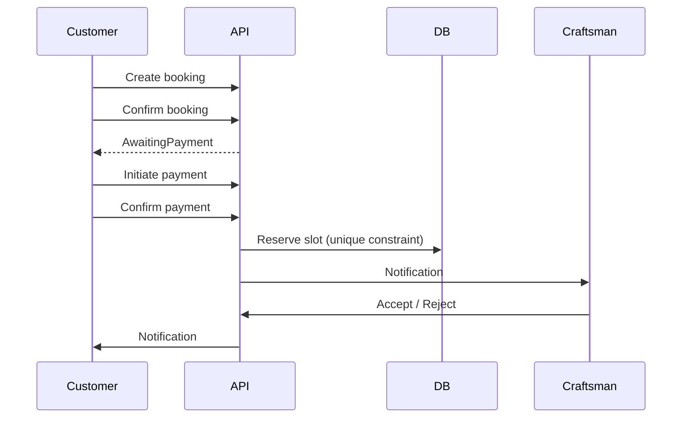

# Booking Module

Complete booking flow for KHADAMATI with payment, craftsman confirmation, calendar double-booking prevention, and notifications.

## Booking States

| State | Description |
|-------|-------------|
| Pending | Customer created booking |
| AwaitingPayment | Customer confirmed, payment required |
| PaymentConfirmed | Payment received, slot reserved |
| PendingCraftsmanConfirmation | Craftsman notified |
| Confirmed | Craftsman accepted |
| Completed | Service done |
| Cancelled | Cancelled by customer/craftsman |
| Rejected | Craftsman rejected |
| Expired | Payment/confirmation timeout |
| NoShow | Customer did not show |
| Rescheduled | New time selected |

## Flow



## API Endpoints

### Customer / Craftsman (`/api/v1/bookings`)

| Method | Endpoint | Role | Description |
|--------|----------|------|-------------|
| GET | `/craftsmen?serviceId=` | Anonymous | List craftsmen |
| GET | `/availability?craftsmanId=&serviceId=&date=` | Anonymous | Available slots |
| POST | `/` | Customer | Create booking |
| GET | `/` | Auth | List my bookings |
| GET | `/{id}` | Auth | Booking details |
| POST | `/{id}/confirm` | Customer | Confirm → AwaitingPayment |
| POST | `/{id}/payment` | Customer | Initiate payment (Pending) |
| POST | `/{id}/payment/confirm` | Customer | Confirm payment, reserve slot |
| POST | `/{id}/accept` | Craftsman | Accept booking |
| POST | `/{id}/reject` | Craftsman | Reject booking |
| POST | `/{id}/cancel` | Auth | Cancel booking |
| POST | `/{id}/complete` | Craftsman | Mark complete |
| POST | `/{id}/no-show` | Craftsman | Mark no-show |
| POST | `/{id}/reschedule` | Auth | Reschedule |

### Admin (`/api/v1/admin/bookings`)

| Method | Endpoint | Description |
|--------|----------|-------------|
| GET | `/` | Monitor all bookings |
| GET | `/stats` | Dashboard statistics |

### Notifications (`/api/v1/notifications`)

| Method | Endpoint | Description |
|--------|----------|-------------|
| GET | `/` | List notifications |
| POST | `/{id}/read` | Mark as read |

## Double Booking Prevention

- `BookingSlotReservations` table with unique index on `(CraftsmanId, SlotStart)` for active reservations
- Slot check before create and before payment confirmation
- Availability API excludes booked slots and active bookings

## Database Tables

- `ServiceRequests` (extended with booking fields)
- `BookingSlotReservations`
- `CraftsmanWorkingHours`
- `BookingPayments`
- `Notifications`
- `ServiceRequestStatusHistories`

## Clients

- **Web:** Booking wizard, my bookings, detail, payment (`/bookings/*`)
- **Android:** My Bookings tab, booking detail with accept/reject/pay
- **iOS:** Bookings tab with list and detail views

## Tests

```bash
cd src/backend && dotnet test
```
