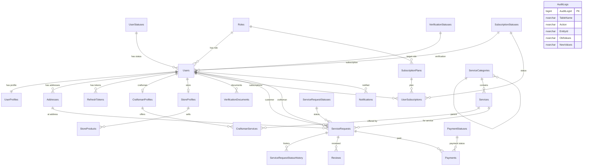

# KHADAMATI — SQL Server Database Documentation

Complete enterprise database for the KHADAMATI maintenance and home services marketplace.

## Deployment

```bash
# Using sqlcmd (run scripts in order)
cd src/database
sqlcmd -S localhost -U sa -P "Khadamati@2024!" -i 001_CreateDatabase.sql
sqlcmd -S localhost -U sa -P "Khadamati@2024!" -i 002_CreateTables.sql
sqlcmd -S localhost -U sa -P "Khadamati@2024!" -i 003_CreateIndexes.sql
sqlcmd -S localhost -U sa -P "Khadamati@2024!" -i 004_CreateViews.sql
sqlcmd -S localhost -U sa -P "Khadamati@2024!" -i 005_CreateStoredProcedures.sql
sqlcmd -S localhost -U sa -P "Khadamati@2024!" -i 006_CreateTriggers.sql
sqlcmd -S localhost -U sa -P "Khadamati@2024!" -i 007_SeedData.sql
```

Or use `000_MasterDeploy.sql` with sqlcmd `:r` includes from the database directory.

## Standard Audit Columns (Every Table)

| Column | Type | Description |
|--------|------|-------------|
| `CreatedDate` | DATETIME2(7) | UTC timestamp when the row was created. Defaults to `SYSUTCDATETIME()`. |
| `ModifiedDate` | DATETIME2(7) | UTC timestamp of the last update. Set automatically by triggers on UPDATE. |
| `CreatedBy` | NVARCHAR(128) | User or system identifier that created the row (e.g. email, `SEED`, `SYSTEM`). |
| `ModifiedBy` | NVARCHAR(128) | User or system identifier that last modified the row. |
| `Deleted` | BIT | Soft-delete flag. `0` = active, `1` = logically deleted. Default `0`. |
| `DeletedDate` | DATETIME2(7) | UTC timestamp when the row was soft-deleted. |
| `DeletedBy` | NVARCHAR(128) | User or system identifier that performed the soft delete. |

**Soft delete**: Rows are never physically removed in normal operations. All queries should filter `WHERE Deleted = 0`. Filtered indexes are defined on `Deleted = 0` for performance.

## Identity Columns

| Table | Identity Column | Type |
|-------|-----------------|------|
| `ref.Roles` | `RoleId` | INT IDENTITY |
| `ref.UserStatuses` | `StatusId` | INT IDENTITY |
| `ref.VerificationStatuses` | `VerificationStatusId` | INT IDENTITY |
| `ref.SubscriptionStatuses` | `SubscriptionStatusId` | INT IDENTITY |
| `ref.ServiceRequestStatuses` | `RequestStatusId` | INT IDENTITY |
| `ref.PaymentStatuses` | `PaymentStatusId` | INT IDENTITY |
| `dbo.SubscriptionPlans` | `PlanId` | INT IDENTITY |
| `dbo.ServiceRequestStatusHistory` | `HistoryId` | BIGINT IDENTITY |
| `audit.AuditLogs` | `AuditLogId` | BIGINT IDENTITY |
| `dbo.AuditLogs` | `Id` | BIGINT IDENTITY (legacy API compat) |

Business entities use `UNIQUEIDENTIFIER` with `NEWSEQUENTIALID()` for distributed-system-friendly primary keys.

---

## ER Diagram



---

## Table Reference

### Schema: `ref` — Reference / Lookup Tables

#### `ref.Roles`
**Purpose**: Defines the four platform user types.

| PK | `RoleId` INT IDENTITY |
|----|----------------------|
| Values | Customer, Craftsman, Store, Administrator |

Stores bilingual role names (EN/AR). Every user must reference exactly one role. Used by `dbo.Users.RoleId` and `dbo.SubscriptionPlans.TargetRoleId`.

---

#### `ref.UserStatuses`
**Purpose**: Account lifecycle state (pending approval, active, suspended, banned).

| PK | `StatusId` INT IDENTITY |
|----|-------------------------|
| FK from | `dbo.Users.StatusId` |

Controls whether a user can log in and access the platform.

---

#### `ref.VerificationStatuses`
**Purpose**: Identity/business verification workflow for craftsmen and stores.

| PK | `VerificationStatusId` INT IDENTITY |
|----|-------------------------------------|
| FK from | `dbo.Users.VerificationStatusId`, `dbo.VerificationDocuments.VerificationStatusId` |

Values: Unverified → PendingReview → Verified / Rejected.

---

#### `ref.SubscriptionStatuses`
**Purpose**: Subscription billing state for craftsmen and stores.

| PK | `SubscriptionStatusId` INT IDENTITY |
|----|-----------------------------------|
| FK from | `dbo.Users.SubscriptionStatusId`, `dbo.UserSubscriptions.SubscriptionStatusId` |

---

#### `ref.ServiceRequestStatuses`
**Purpose**: Workflow states for service bookings.

| PK | `RequestStatusId` INT IDENTITY |
|----|-------------------------------|
| FK from | `dbo.ServiceRequests.RequestStatusId`, `dbo.ServiceRequestStatusHistory` |

Flow: Draft → Pending → Assigned → InProgress → Completed (or Cancelled / Disputed).

---

#### `ref.PaymentStatuses`
**Purpose**: Payment transaction states.

| PK | `PaymentStatusId` INT IDENTITY |
|----|-------------------------------|
| FK from | `dbo.Payments.PaymentStatusId` |

---

### Schema: `dbo` — Business Tables

#### `dbo.Users`
**Purpose**: Central authentication and authorization entity for all user types.

| PK | `Id` UNIQUEIDENTIFIER |
|----|----------------------|
| UK | `Email`, `Phone` |
| FK | `RoleId` → `ref.Roles`, `StatusId` → `ref.UserStatuses`, `VerificationStatusId`, `SubscriptionStatusId` |

Stores `PasswordHash` (BCrypt), login security (`FailedLoginAttempts`, `LockoutEnd`), and subscription expiry. One row per person/business account. Profile details live in `UserProfiles`; role-specific data in `CraftsmanProfiles` or `StoreProfiles`.

---

#### `dbo.UserProfiles`
**Purpose**: Personal profile information separated from credentials.

| PK | `Id` UNIQUEIDENTIFIER |
|----|----------------------|
| FK | `UserId` → `dbo.Users` (1:1, UNIQUE) |

Contains name, bio, profile picture URL, preferred language (`ar`/`en`), national ID, date of birth, and gender.

---

#### `dbo.Addresses`
**Purpose**: Physical locations with GPS coordinates for service dispatch and craftsman proximity search.

| PK | `Id` UNIQUEIDENTIFIER |
|----|----------------------|
| FK | `UserId` → `dbo.Users` |

Supports multiple addresses per user with `IsDefault` flag. `Latitude`/`Longitude` power `sp_GetNearbyCraftsmen`.

---

#### `dbo.RefreshTokens`
**Purpose**: JWT refresh token storage for secure session management.

| PK | `Id` UNIQUEIDENTIFIER |
|----|----------------------|
| FK | `UserId` → `dbo.Users` |
| UK | `Token` |

Tracks expiry, revocation, IP addresses, and token rotation (`ReplacedByToken`). Cleaned by `sp_CleanupExpiredRefreshTokens`.

---

#### `dbo.CraftsmanProfiles`
**Purpose**: Craftsman-specific business profile and performance metrics.

| PK | `Id` UNIQUEIDENTIFIER |
|----|----------------------|
| FK | `UserId` → `dbo.Users` (1:1) |

Stores specialization, experience, rating, review count, completed jobs, availability, service radius, and license number.

---

#### `dbo.StoreProfiles`
**Purpose**: Store-specific business profile.

| PK | `Id` UNIQUEIDENTIFIER |
|----|----------------------|
| FK | `UserId` → `dbo.Users` (1:1) |

Store name, commercial registration, description, rating, opening hours, and open/closed status.

---

#### `dbo.VerificationDocuments`
**Purpose**: Uploaded documents for identity/business verification review.

| PK | `Id` UNIQUEIDENTIFIER |
|----|----------------------|
| FK | `UserId` → `dbo.Users`, `VerificationStatusId`, `ReviewedByUserId` → `dbo.Users` |

Admins review documents and set Verified/Rejected with optional `RejectionReason`.

---

#### `dbo.SubscriptionPlans`
**Purpose**: Available subscription tiers for craftsmen and stores.

| PK | `PlanId` INT IDENTITY |
|----|----------------------|
| FK | `TargetRoleId` → `ref.Roles` |

Defines plan code, bilingual names, price, duration in days, and active flag.

---

#### `dbo.UserSubscriptions`
**Purpose**: Historical and active subscription records per user.

| PK | `Id` UNIQUEIDENTIFIER |
|----|----------------------|
| FK | `UserId`, `PlanId`, `SubscriptionStatusId` |

Tracks start/end dates and auto-renew preference.

---

#### `dbo.ServiceCategories`
**Purpose**: Hierarchical catalog of service types (bilingual).

| PK | `Id` UNIQUEIDENTIFIER |
|----|----------------------|
| FK | `ParentCategoryId` → self (optional parent) |

Supports nested categories (e.g. Plumbing → Leak Repair). `DisplayOrder` controls UI sorting.

---

#### `dbo.Services`
**Purpose**: Individual services offered on the platform.

| PK | `Id` UNIQUEIDENTIFIER |
|----|----------------------|
| FK | `CategoryId` → `dbo.ServiceCategories` |

Bilingual name/description, base price, estimated duration, image URL, and active flag.

---

#### `dbo.CraftsmanServices`
**Purpose**: Junction table linking craftsmen to services they offer with custom pricing.

| PK | `Id` UNIQUEIDENTIFIER |
|----|----------------------|
| FK | `CraftsmanProfileId`, `ServiceId` |
| UK | (`CraftsmanProfileId`, `ServiceId`) |

---

#### `dbo.StoreProducts`
**Purpose**: Products sold by stores (tools, materials, etc.).

| PK | `Id` UNIQUEIDENTIFIER |
|----|----------------------|
| FK | `StoreProfileId` → `dbo.StoreProfiles` |

SKU, stock quantity, bilingual names, price, and image.

---

#### `dbo.ServiceRequests`
**Purpose**: Core transaction entity — a customer booking a service from a craftsman.

| PK | `Id` UNIQUEIDENTIFIER |
|----|----------------------|
| FK | `CustomerId`, `CraftsmanId` → `dbo.Users`; `ServiceId`; `AddressId`; `RequestStatusId` |

Tracks scheduling, pricing (estimated/final), completion, and customer rating/review.

---

#### `dbo.ServiceRequestStatusHistory`
**Purpose**: Immutable audit trail of status changes on service requests.

| PK | `HistoryId` BIGINT IDENTITY |
|----|----------------------------|
| FK | `ServiceRequestId`, old/new status IDs, `ChangedByUserId` |

Populated by `sp_UpdateServiceRequestStatus` and `TR_ServiceRequests_StatusHistory` trigger.

---

#### `dbo.Reviews`
**Purpose**: Structured ratings and comments after service completion.

| PK | `Id` UNIQUEIDENTIFIER |
|----|----------------------|
| FK | `ServiceRequestId`, `ReviewerUserId`, `ReviewedUserId` |
| UK | (`ServiceRequestId`, `ReviewerUserId`) |
| CK | Rating 1–5 |

---

#### `dbo.Payments`
**Purpose**: Financial transactions linked to service requests.

| PK | `Id` UNIQUEIDENTIFIER |
|----|----------------------|
| FK | `ServiceRequestId`, `PayerUserId`, `PayeeUserId`, `PaymentStatusId` |

Amount, currency (default SAR), payment method, transaction reference, and paid timestamp.

---

#### `dbo.Notifications`
**Purpose**: In-app notifications for users (bilingual).

| PK | `Id` UNIQUEIDENTIFIER |
|----|----------------------|
| FK | `UserId` → `dbo.Users` |

Type, optional `ReferenceId` (e.g. request ID), read status and timestamp.

---

#### `dbo.AuditLogs` (legacy)
**Purpose**: Backward-compatible audit table used by the ASP.NET Core API layer.

| PK | `Id` BIGINT IDENTITY |

---

### Schema: `audit`

#### `audit.AuditLogs`
**Purpose**: Enterprise audit trail for INSERT, UPDATE, DELETE, and SOFT_DELETE operations.

| PK | `AuditLogId` BIGINT IDENTITY |

Stores schema/table name, action type, entity ID, JSON old/new values, changed columns, user context, and IP address. Written by triggers and `audit.sp_InsertAuditLog`.

---

## Views

| View | Purpose |
|------|---------|
| `vw_ActiveUsers` | Active users with profile and role/status codes |
| `vw_ServiceRequestSummary` | Request details with customer/craftsman names |
| `vw_CraftsmanDirectory` | Searchable craftsman listing with ratings and location |
| `vw_StoreDirectory` | Store listing with product counts |
| `vw_PaymentSummary` | Payment details with payer/payee names |
| `vw_DashboardMetrics` | Admin dashboard KPIs (counts, revenue) |

## Stored Procedures

| Procedure | Purpose |
|-----------|---------|
| `audit.sp_InsertAuditLog` | Insert a manual audit record |
| `dbo.sp_GetNearbyCraftsmen` | GPS radius search for available craftsmen |
| `dbo.sp_GetDashboardStats` | Return dashboard metrics |
| `dbo.sp_SoftDeleteUser` | Cascade soft-delete user and related rows |
| `dbo.sp_UpdateServiceRequestStatus` | Change request status with history logging |
| `dbo.sp_GetUserProfile` | User profile + addresses (2 result sets) |
| `dbo.sp_GetUnreadNotifications` | Paginated unread notifications |
| `dbo.sp_CleanupExpiredRefreshTokens` | Soft-delete expired/revoked tokens |

## Seed Data

| Entity | Records |
|--------|---------|
| All reference tables | Complete lookup values (EN/AR) |
| Subscription plans | 3 plans (Craftsman Basic/Pro, Store Basic) |
| Admin user | `admin@khadamati.com` / `Admin@123456` |
| Sample customer | `customer@khadamati.com` |
| Sample craftsman | `craftsman@khadamati.com` with profile + address |
| Service categories | 5 categories (Plumbing, Electrical, HVAC, Painting, Cleaning) |
| Services | 6 services with SAR pricing |

## File Structure

```
src/database/
├── 000_MasterDeploy.sql      # Master runner (sqlcmd :r includes)
├── 001_CreateDatabase.sql    # Database + schemas
├── 002_CreateTables.sql      # All tables, PKs, FKs
├── 003_CreateIndexes.sql     # Performance indexes (filtered)
├── 004_CreateViews.sql       # Reporting views
├── 005_CreateStoredProcedures.sql
├── 006_CreateTriggers.sql    # Audit + ModifiedDate triggers
├── 007_SeedData.sql          # Reference + sample data
└── README.md
```
