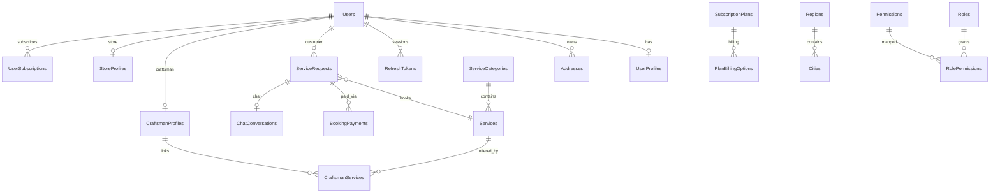

# KHADAMATI — Database Baseline (Phase 0)

**Document version:** 1.0  
**Date:** 2026-07-22  
**Canonical schema authority:** Entity Framework Core migrations (`ApplicationDbContext` + `Migrations/`)

---

## 1. Schema Authority

| Source | Role | Status |
|--------|------|--------|
| **EF Core migrations** (`src/backend/Khadamati.Infrastructure/Data/Migrations/`) | **Canonical** — used at runtime (`MigrateOnStartup`) | ✅ Active |
| **SQL scripts** (`src/database/000–013_*.sql`) | Legacy / reference — **not deployed by master script beyond 007** | ⚠️ Drifted |
| **In-memory DB** | Integration/unit test isolation | Test only |

**Rule for Phase 1+:** All schema changes must go through EF migrations. SQL scripts require explicit reconciliation or archival.

---

## 2. Database Technology

| Item | Value |
|------|-------|
| Engine | Microsoft SQL Server |
| Dev targets | SQL Server 2014+ (Windows), SQL Server 2022 (Docker) |
| ORM | EF Core 8.0.11 |
| Provider | `Microsoft.EntityFrameworkCore.SqlServer` |
| Database name | `KhadamatiDb` |
| Soft delete | Global query filters on `IsDeleted` |
| Audit columns | `CreatedAt`, `UpdatedAt` via `BaseEntity` |
| Concurrency | ❌ No `rowversion` on bookings/slots/coupons |

---

## 3. Entity / Table Inventory (44 tables)

All tables are in schema `dbo` unless noted.

### 3.1 Identity & Security

| Table | Entity | Purpose |
|-------|--------|---------|
| `Users` | `User` | Accounts, credentials, status, lockout |
| `UserProfiles` | `UserProfile` | Display name, avatar, language, preferences |
| `RefreshTokens` | `RefreshToken` | JWT refresh sessions |
| `EmailVerificationTokens` | `EmailVerificationToken` | Email confirmation |
| `PasswordResetTokens` | `PasswordResetToken` | Password reset flow |
| `PhoneOtpTokens` | `PhoneOtpToken` | Phone OTP verification |
| `PasswordHistory` | `PasswordHistory` | Password reuse prevention |
| `LoginHistory` | `LoginHistory` | Login audit trail |
| `SecurityLogs` | `SecurityLog` | Security events |
| `Roles` | `Role` | RBAC roles (GUID PK) |
| `Permissions` | `Permission` | Permission codes |
| `RolePermissions` | `RolePermission` | Role ↔ permission mapping |
| `UserRoles` | `UserRoleAssignment` | User ↔ role assignment |
| `UserPermissions` | `UserPermission` | User-level permission overrides |

### 3.2 User Data

| Table | Entity | Purpose |
|-------|--------|---------|
| `Addresses` | `Address` | User service/delivery addresses |
| `VerificationDocuments` | `VerificationDocument` | KYC document uploads |

### 3.3 Service Catalog

| Table | Entity | Purpose |
|-------|--------|---------|
| `ServiceCategories` | `ServiceCategory` | Bilingual categories |
| `Services` | `Service` | Bookable services, base price |
| `CraftsmanProfiles` | `CraftsmanProfile` | Craftsman business profile |
| `CraftsmanServices` | `CraftsmanService` | Craftsman ↔ service links |
| `CraftsmanWorkingHours` | `CraftsmanWorkingHour` | Weekly availability |
| `StoreProfiles` | `StoreProfile` | Store business profile |
| `StoreProducts` | `StoreProduct` | Store product catalog |

### 3.4 Bookings & Payments

| Table | Entity | Purpose |
|-------|--------|---------|
| `ServiceRequests` | `ServiceRequest` | Bookings / service requests |
| `ServiceRequestStatusHistories` | `ServiceRequestStatusHistory` | Status transition log |
| `BookingSlotReservations` | `BookingSlotReservation` | Time slot holds |
| `BookingPayments` | `BookingPayment` | Payment records |

### 3.5 Subscriptions

| Table | Entity | Purpose |
|-------|--------|---------|
| `SubscriptionPlans` | `SubscriptionPlan` | Plan definitions |
| `PlanBillingOptions` | `PlanBillingOption` | Billing intervals per plan |
| `UserSubscriptions` | `UserSubscription` | Active/historical subscriptions |

### 3.6 Messaging

| Table | Entity | Purpose |
|-------|--------|---------|
| `Notifications` | `Notification` | In-app notifications |
| `DevicePushTokens` | `DevicePushToken` | FCM/APNs device tokens |
| `ChatConversations` | `ChatConversation` | Per-booking chat threads |
| `ChatMessages` | `ChatMessage` | Chat messages |

### 3.7 Support & Marketing

| Table | Entity | Purpose |
|-------|--------|---------|
| `Complaints` | `Complaint` | User complaints |
| `SupportTickets` | `SupportTicket` | Support tickets |
| `Coupons` | `Coupon` | Discount coupons |
| `Advertisements` | `Advertisement` | Marketing placements |

### 3.8 Locations & Settings

| Table | Entity | Purpose |
|-------|--------|---------|
| `Regions` | `Region` | Geographic regions |
| `Cities` | `City` | Cities linked to regions |
| `SystemSettings` | `SystemSetting` | Key-value platform settings |

### 3.9 Administration & Audit

| Table | Entity | Purpose |
|-------|--------|---------|
| `AuditLogs` | `AuditLog` | Data change audit |
| `ActivityLogs` | `ActivityLog` | User activity log |
| `BackupJobs` | `BackupJob` | Backup/restore job tracking |

---

## 4. Key Relationships (Simplified)

---

## 5. SQL Scripts vs EF Drift

### 5.1 Deployment Coverage

| Script | Included in `000_MasterDeploy.sql` | EF Equivalent |
|--------|-----------------------------------|---------------|
| `001_CreateDatabase.sql` | ✅ | Auto via connection |
| `002_CreateTables.sql` | ✅ | Migrations (different design) |
| `003_CreateIndexes.sql` | ✅ | Migration indexes |
| `004_CreateViews.sql` | ✅ | ❌ No EF views |
| `005_CreateStoredProcedures.sql` | ✅ | ❌ Logic in C# services |
| `006_CreateTriggers.sql` | ✅ | ❌ EF `SaveChanges` audit |
| `007_SeedData.sql` | ✅ | `DatabaseSeeder.cs` |
| `008_AuthModule.sql` | ❌ Not in master | Covered by migrations |
| `009_SubscriptionManagement.sql` | ❌ | Covered by migrations |
| `010_BookingModule.sql` | ❌ | Covered by migrations |
| `011_AdminDashboard.sql` | ❌ | Covered by migrations |
| `012_IdentityModule.sql` | ❌ | Covered by migrations |
| `013_UserManagement.sql` | ❌ | Covered by migrations |

### 5.2 Structural Differences

| Aspect | SQL Scripts (`002_CreateTables.sql`) | EF Migrations |
|--------|--------------------------------------|---------------|
| Schema layout | `ref.*` lookup tables, INT identity PKs | Single `dbo` schema, GUID PKs |
| Role model | `ref.Roles` (int) | `Roles` (Guid) + permissions matrix |
| Audit columns | `CreatedDate`, `ModifiedDate`, `Deleted` | `CreatedAt`, `UpdatedAt`, `IsDeleted` |
| Stored procedures | Yes (`005_`) | No — application layer |
| Views | Yes (`004_`) | No |
| Triggers | Yes (`006_`) | No — EF interceptors / SaveChanges |

**Impact:** Running `000_MasterDeploy.sql` on a fresh server produces a **different** database than `dotnet ef database update`. Do not mix both on the same database.

---

## 6. Migration History

Latest migration (as of baseline): `20260709142854_FixRescheduledFromCascade`

Startup behavior (`Program.cs`):
- `Database:MigrateOnStartup` — applies pending migrations
- `Database:SeedDemoData` — seeds demo users/services in Development
- `Database:ContinueOnFailure` — Development only; allows API boot if SQL unavailable

---

## 7. Seed Data (Development)

| Entity | Seeded credentials / data |
|--------|---------------------------|
| SuperAdmin | `admin@khadamati.com` / `Admin@123456` |
| Demo craftsman | `craftsman1@khadamati.com` / `Craftsman@123` |
| Demo customer | Seeded via `DatabaseSeeder` |
| Services | e.g. "Leak Repair" (used in integration tests) |
| Regions/Cities | Saudi defaults |

Bootstrap admin (Staging/Production): `Bootstrap:AdminEmail`, `Bootstrap:AdminPassword` — only if no admin exists.

---

## 8. Indexes & Performance Notes

- EF migrations include indexes on foreign keys and common query fields
- SQL `003_CreateIndexes.sql` indexes **do not** match EF index names — reference only
- Nearby craftsman query uses lat/long on addresses — verify indexes in Phase 1
- No table partitioning or read replicas configured

---

## 9. Backup & Recovery

| Mechanism | Location |
|-----------|----------|
| Admin backup API | `AdminController` → `DatabaseBackupService` |
| Storage path | `Backup:StoragePath` (default `backups`) |
| Docker volume | `sqlserver_data` in `docker-compose.yml` |

---

## 10. Phase 1 Recommendations (Not Implemented)

1. Archive or rewrite `src/database/` scripts to align with EF or mark as deprecated
2. Add `rowversion` to `ServiceRequests`, `BookingSlotReservations`, `Coupons`
3. Add `Countries` table and decouple currency defaults from SAR
4. Document migration rollback procedure per release
5. Add schema diff CI check (EF model vs deployed DB)

---

## 11. Related Documents

- [TRACEABILITY_MATRIX.md](./TRACEABILITY_MATRIX.md)
- [API_INVENTORY.md](./API_INVENTORY.md)
- [DEPLOYMENT_RUNBOOK.md](./DEPLOYMENT_RUNBOOK.md)
- [DATABASE.md](./DATABASE.md) (legacy module doc)
