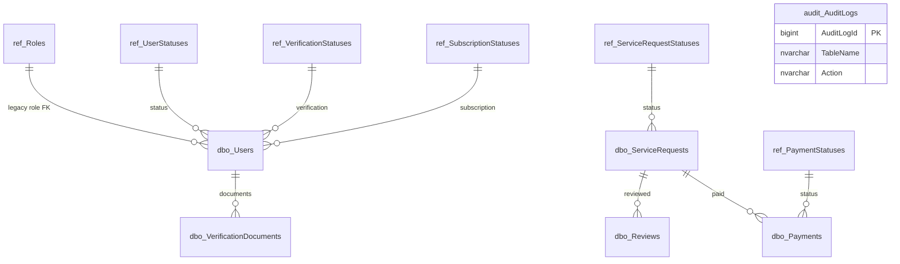
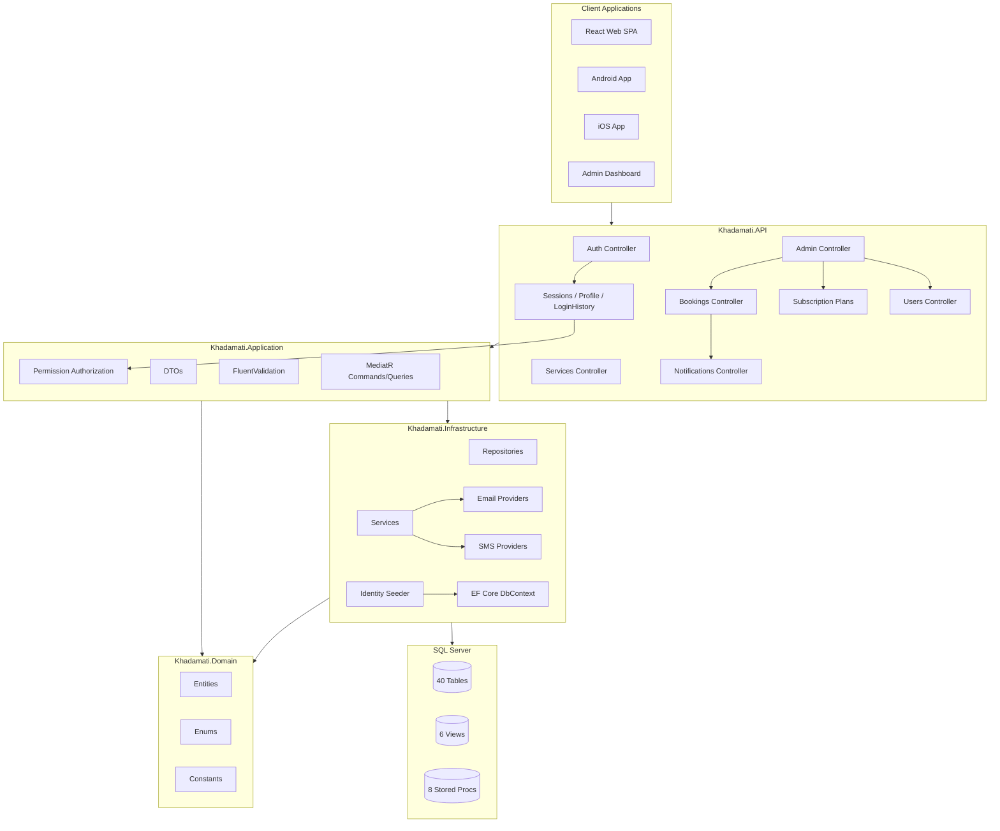
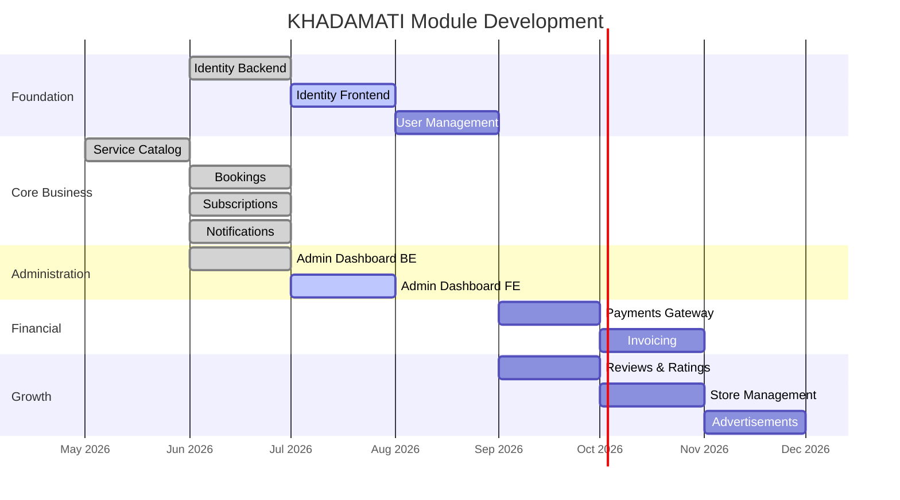

# KHADAMATI — Platform Architecture Reference

Master reference for database design, APIs, module dependencies, folder layout, coding standards, naming conventions, permissions, and development roadmap.

**Last updated:** July 2026  
**API version:** `v1`  
**Default admin:** `admin@khadamati.com` / `Admin@123456` (SuperAdmin)

---

## Table of Contents

1. [Complete Database ERD](#1-complete-database-erd)
2. [List of Every Table](#2-list-of-every-table)
3. [Relationships](#3-relationships)
4. [API List](#4-api-list)
5. [Module Dependency Diagram](#5-module-dependency-diagram)
6. [Folder Structure](#6-folder-structure)
7. [Coding Standards](#7-coding-standards)
8. [Database Naming Conventions](#8-database-naming-conventions)
9. [Permission Matrix](#9-permission-matrix)
10. [Development Roadmap](#10-development-roadmap)

---

## 1. Complete Database ERD

### 1.1 Entity Framework Core (Primary Runtime Schema)

The ASP.NET Core API uses EF Core with **43 tables** in the `dbo` schema. All business entities use `UNIQUEIDENTIFIER` primary keys (`Id`) except where noted.

```mermaid
erDiagram
    %% ── Identity & Auth ──
    Roles ||--o{ UserRoles : "assigned to"
    Roles ||--o{ RolePermissions : "grants"
    Permissions ||--o{ RolePermissions : "granted via"
    Permissions ||--o{ UserPermissions : "direct override"
    Users ||--o{ UserRoles : "has"
    Users }o--|| Roles : "primary role"
    Users ||--o{ UserPermissions : "direct perms"
    Users ||--|| UserProfiles : "1:1"
    Users ||--o{ Addresses : "has"
    Users ||--o{ RefreshTokens : "sessions"
    Users ||--o{ EmailVerificationTokens : "email verify"
    Users ||--o{ PasswordResetTokens : "password reset"
    Users ||--o{ PhoneOtpTokens : "phone OTP"
    Users ||--o{ PasswordHistory : "password history"
    Users ||--o{ LoginHistory : "login events"
    Users ||--o{ SecurityLogs : "security events"

    %% ── Actor Profiles ──
    Users ||--o| CraftsmanProfiles : "craftsman"
    Users ||--o| StoreProfiles : "store owner"
    CraftsmanProfiles ||--o{ CraftsmanServices : "offers"
    CraftsmanProfiles ||--o{ CraftsmanWorkingHours : "schedule"
    StoreProfiles ||--o{ StoreProducts : "inventory"

    %% ── Service Catalog ──
    ServiceCategories ||--o{ ServiceCategories : "parent/child"
    ServiceCategories ||--o{ Services : "contains"
    Services ||--o{ CraftsmanServices : "offered by"
    Services ||--o{ ServiceRequests : "booked"

    %% ── Bookings ──
    Users ||--o{ ServiceRequests : "customer"
    Users ||--o{ ServiceRequests : "craftsman"
    Addresses ||--o{ ServiceRequests : "location"
    ServiceRequests ||--o{ ServiceRequestStatusHistories : "status trail"
    ServiceRequests ||--o| BookingPayments : "payment"
    ServiceRequests ||--o| BookingSlotReservations : "slot lock"
    ServiceRequests ||--o| ServiceRequests : "rescheduled from"

    %% ── Subscriptions ──
    SubscriptionPlans ||--o{ PlanBillingOptions : "billing cycles"
    SubscriptionPlans ||--o{ UserSubscriptions : "subscribed"
    Users ||--o{ UserSubscriptions : "subscriber"

    %% ── Notifications ──
    Users ||--o{ Notifications : "receives"

    %% ── Admin ──
    Regions ||--o{ Cities : "contains"
    Users ||--o{ Complaints : "complainant"
    Users ||--o{ SupportTickets : "requester"
    Users ||--o{ ActivityLogs : "actor"

    %% ── Audit ──
    Users ||--o{ AuditLogs : "changed by"
```



### 1.2 Legacy SQL Schema (Reference / Stored Procedures)

The original SQL deployment scripts (`src/database/002_CreateTables.sql`) define additional objects used by stored procedures, views, and triggers. EF Core is the source of truth for the API; these coexist during migration:



---

## 2. List of Every Table

### 2.1 EF Core Tables (40) — Active in API

| # | Table | Module | Purpose |
|---|-------|--------|---------|
| **Identity & Auth** |
| 1 | `Users` | Identity | Central account: credentials, status, lockout, verification timestamps |
| 2 | `UserProfiles` | Identity | Display name, bio, avatar, language, gender, DOB, address, GPS, timezone |
| 3 | `Addresses` | Identity | User locations with GPS coordinates and default flag |
| 4 | `RefreshTokens` | Identity | JWT refresh tokens / sessions with device info and rotation |
| 5 | `EmailVerificationTokens` | Identity | One-time email verification tokens |
| 6 | `PasswordResetTokens` | Identity | Password reset tokens with expiry |
| 7 | `PhoneOtpTokens` | Identity | Phone OTP verification tokens |
| 8 | `Roles` | Identity | RBAC roles (9 system roles) |
| 9 | `UserRoles` | Identity | User-to-role assignments (supports multiple roles) |
| 10 | `UserPermissions` | Identity | Direct permission grants/denies per user |
| 11 | `Permissions` | Identity | Permission definitions (30 codes) |
| 12 | `RolePermissions` | Identity | Role-to-permission mapping |
| 13 | `LoginHistory` | Identity | Login attempt audit (success/fail, IP, device) |
| 14 | `SecurityLogs` | Identity | Security events (password change, lockout, etc.) |
| 15 | `PasswordHistory` | Identity | Previous password hashes for reuse prevention |
| **Actor Profiles** |
| 16 | `CraftsmanProfiles` | Users | Craftsman specialization, rating, availability, radius |
| 17 | `StoreProfiles` | Users | Store details, hours, commercial registration |
| 18 | `CraftsmanServices` | Catalog | Junction: craftsman ↔ service with custom pricing |
| 19 | `StoreProducts` | Catalog | Store inventory (SKU, stock, price) |
| **Service Catalog** |
| 20 | `ServiceCategories` | Catalog | Hierarchical categories (AR/EN) |
| 21 | `Services` | Catalog | Individual services with base price and duration |
| **Bookings** |
| 22 | `ServiceRequests` | Bookings | Core booking entity (customer, craftsman, schedule, price) |
| 23 | `ServiceRequestStatusHistories` | Bookings | Immutable status change trail |
| 24 | `BookingSlotReservations` | Bookings | Slot locks to prevent double booking |
| 25 | `CraftsmanWorkingHours` | Bookings | Weekly availability schedule per craftsman |
| 26 | `BookingPayments` | Bookings | Payment records linked to bookings |
| **Subscriptions** |
| 27 | `SubscriptionPlans` | Subscriptions | Plan definitions with feature limits and badges |
| 28 | `PlanBillingOptions` | Subscriptions | Monthly/yearly billing cycles per plan |
| 29 | `UserSubscriptions` | Subscriptions | Active and historical user subscriptions |
| **Notifications** |
| 30 | `Notifications` | Notifications | In-app notifications (bilingual, read status) |
| **Admin Dashboard** |
| 31 | `Advertisements` | Admin | Platform advertisements with placement and metrics |
| 32 | `Coupons` | Admin | Discount coupons with usage limits |
| 33 | `Complaints` | Admin | User complaints against bookings/users |
| 34 | `SupportTickets` | Admin | Support ticket tracking |
| 35 | `Regions` | Admin | Geographic regions (AR/EN) |
| 36 | `Cities` | Admin | Cities within regions |
| 37 | `SystemSettings` | Admin | Key-value platform configuration |
| 38 | `ActivityLogs` | Admin | Admin action activity log |
| 39 | `BackupJobs` | Admin | Database backup job records |
| **Audit** |
| 40 | `AuditLogs` | Audit | Change tracking (table, action, old/new values) |

### 2.2 SQL-Only / Legacy Tables (10)

| # | Table | Schema | Status |
|---|-------|--------|--------|
| 1 | `Roles` | `ref` | Legacy lookup; EF uses `dbo.Roles` |
| 2 | `UserStatuses` | `ref` | Legacy; EF uses `UserStatus` enum |
| 3 | `VerificationStatuses` | `ref` | Legacy; EF uses `VerificationStatus` enum |
| 4 | `SubscriptionStatuses` | `ref` | Legacy; EF uses `SubscriptionStatus` enum |
| 5 | `ServiceRequestStatuses` | `ref` | Legacy; EF uses `ServiceRequestStatus` enum |
| 6 | `PaymentStatuses` | `ref` | Legacy; EF uses enum in `BookingPayments` |
| 7 | `VerificationDocuments` | `dbo` | Planned; not yet in EF |
| 8 | `Reviews` | `dbo` | Planned; rating stored on `ServiceRequests` for now |
| 9 | `Payments` | `dbo` | Legacy; EF uses `BookingPayments` |
| 10 | `AuditLogs` | `audit` | Enterprise audit via triggers; EF has `dbo.AuditLogs` |

### 2.3 Database Views (6)

| View | Purpose |
|------|---------|
| `vw_ActiveUsers` | Active users with profile and role/status |
| `vw_ServiceRequestSummary` | Booking details with customer/craftsman names |
| `vw_CraftsmanDirectory` | Searchable craftsman listing |
| `vw_StoreDirectory` | Store listing with product counts |
| `vw_PaymentSummary` | Payment details with payer/payee |
| `vw_DashboardMetrics` | Admin KPIs |

### 2.4 Stored Procedures (8)

| Procedure | Purpose |
|-----------|---------|
| `audit.sp_InsertAuditLog` | Manual audit record insertion |
| `dbo.sp_GetNearbyCraftsmen` | GPS radius craftsman search |
| `dbo.sp_GetDashboardStats` | Dashboard metrics |
| `dbo.sp_SoftDeleteUser` | Cascade soft-delete user |
| `dbo.sp_UpdateServiceRequestStatus` | Status change with history |
| `dbo.sp_GetUserProfile` | Profile + addresses |
| `dbo.sp_GetUnreadNotifications` | Paginated unread notifications |
| `dbo.sp_CleanupExpiredRefreshTokens` | Token cleanup |

---

## 3. Relationships

### 3.1 Identity & Auth

| Parent | Child | Cardinality | FK Column | Notes |
|--------|-------|-------------|-----------|-------|
| `Users` | `UserProfiles` | 1:1 | `UserId` | Profile separated from credentials |
| `Users` | `Addresses` | 1:N | `UserId` | Multiple addresses, one default |
| `Users` | `RefreshTokens` | 1:N | `UserId` | Session management |
| `Users` | `EmailVerificationTokens` | 1:N | `UserId` | Email verification flow |
| `Users` | `PasswordResetTokens` | 1:N | `UserId` | Password reset flow |
| `Users` | `PhoneOtpTokens` | 1:N | `UserId` | Phone OTP flow |
| `Users` | `PasswordHistory` | 1:N | `UserId` | Password reuse prevention |
| `Users` | `LoginHistory` | 1:N | `UserId` | Login audit |
| `Users` | `SecurityLogs` | 1:N | `UserId` | Security event audit |
| `Roles` | `Users` | 1:N | `PrimaryRoleId` | Primary role reference |
| `Roles` | `UserRoles` | 1:N | `RoleId` | Multi-role support |
| `Users` | `UserRoles` | 1:N | `UserId` | Role assignments |
| `Roles` | `RolePermissions` | 1:N | `RoleId` | Role permission grants |
| `Permissions` | `RolePermissions` | 1:N | `PermissionId` | Permission definitions |
| `Users` | `UserPermissions` | 1:N | `UserId` | Direct permission overrides |
| `Permissions` | `UserPermissions` | 1:N | `PermissionId` | Grant or deny per user |

### 3.2 Actor Profiles

| Parent | Child | Cardinality | FK Column | Notes |
|--------|-------|-------------|-----------|-------|
| `Users` | `CraftsmanProfiles` | 1:0..1 | `UserId` | One craftsman profile per user |
| `Users` | `StoreProfiles` | 1:0..1 | `UserId` | One store profile per user |
| `CraftsmanProfiles` | `CraftsmanServices` | 1:N | `CraftsmanProfileId` | Services offered |
| `Services` | `CraftsmanServices` | 1:N | `ServiceId` | Junction table |
| `StoreProfiles` | `StoreProducts` | 1:N | `StoreProfileId` | Store inventory |

### 3.3 Service Catalog

| Parent | Child | Cardinality | FK Column | Notes |
|--------|-------|-------------|-----------|-------|
| `ServiceCategories` | `ServiceCategories` | 1:N | `ParentCategoryId` | Self-referencing hierarchy |
| `ServiceCategories` | `Services` | 1:N | `CategoryId` | Services in category |

### 3.4 Bookings

| Parent | Child | Cardinality | FK Column | Notes |
|--------|-------|-------------|-----------|-------|
| `Users` | `ServiceRequests` | 1:N | `CustomerId` | Customer bookings |
| `Users` | `ServiceRequests` | 1:N | `CraftsmanId` | Assigned craftsman |
| `Services` | `ServiceRequests` | 1:N | `ServiceId` | Booked service |
| `Addresses` | `ServiceRequests` | 1:N | `AddressId` | Service location |
| `ServiceRequests` | `ServiceRequestStatusHistories` | 1:N | `ServiceRequestId` | Status audit trail |
| `ServiceRequests` | `BookingPayments` | 1:0..1 | `ServiceRequestId` | Payment record |
| `ServiceRequests` | `BookingSlotReservations` | 1:0..1 | `ServiceRequestId` | Slot lock |
| `ServiceRequests` | `ServiceRequests` | 1:0..1 | `RescheduledFromId` | Reschedule chain |
| `CraftsmanProfiles` | `CraftsmanWorkingHours` | 1:N | `CraftsmanProfileId` | Weekly schedule |

### 3.5 Subscriptions

| Parent | Child | Cardinality | FK Column | Notes |
|--------|-------|-------------|-----------|-------|
| `SubscriptionPlans` | `PlanBillingOptions` | 1:N | `PlanId` | Billing cycles |
| `SubscriptionPlans` | `UserSubscriptions` | 1:N | `PlanId` | Subscriptions |
| `Users` | `UserSubscriptions` | 1:N | `UserId` | Subscriber |

### 3.6 Admin & Other

| Parent | Child | Cardinality | FK Column | Notes |
|--------|-------|-------------|-----------|-------|
| `Regions` | `Cities` | 1:N | `RegionId` | Geographic hierarchy |
| `Users` | `Notifications` | 1:N | `UserId` | In-app notifications |
| `Users` | `Complaints` | 1:N | `ComplainantUserId` | Complaints filed |
| `Users` | `SupportTickets` | 1:N | `UserId` | Support requests |
| `Users` | `ActivityLogs` | 1:N | `UserId` | Admin activity |

---

## 4. API List

**Base URL:** `/api/v1`  
**Authentication:** Bearer JWT (except endpoints marked Anonymous)  
**Response envelope:** `ApiResponse<T>` with `success`, `data`, `message`, `errors`

### 4.1 Authentication & Identity (23 endpoints)

| Method | Endpoint | Auth | Permission | Description |
|--------|----------|------|------------|-------------|
| POST | `/auth/register` | Anonymous | — | Register new account |
| POST | `/auth/login` | Anonymous | — | Login with email/password |
| POST | `/auth/refresh` | Anonymous | — | Refresh access token |
| POST | `/auth/revoke` | Bearer | — | Revoke refresh token |
| POST | `/auth/forgot-password` | Anonymous | — | Request password reset email |
| POST | `/auth/reset-password` | Anonymous | — | Reset password with token |
| POST | `/auth/change-password` | Bearer | — | Change password (authenticated) |
| POST | `/auth/verify-email` | Anonymous | — | Verify email with token |
| POST | `/auth/resend-email-verification` | Bearer | — | Resend verification email |
| POST | `/auth/admin/verify-email` | Bearer | `Users.VerifyEmail` | Admin force-verify email |
| POST | `/auth/phone/send-otp` | Bearer | — | Send phone OTP |
| POST | `/auth/phone/verify-otp` | Bearer | — | Verify phone OTP |
| GET | `/auth/me` | Bearer | — | Current user summary |
| GET | `/auth/permissions` | Bearer | — | Current user permissions |
| GET | `/sessions` | Bearer | `Sessions.View` | List my active sessions |
| GET | `/sessions/user/{userId}` | Bearer | `Sessions.View` | List user sessions (admin) |
| DELETE | `/sessions/{sessionId}` | Bearer | — | Revoke a session |
| DELETE | `/sessions/others` | Bearer | — | Logout other devices |
| DELETE | `/sessions` | Bearer | `Sessions.RevokeAll` | Logout all devices |
| GET | `/profile` | Bearer | — | Get extended profile |
| PUT | `/profile` | Bearer | — | Update extended profile |
| GET | `/login-history` | Bearer | `LoginHistory.View` | Login history (paginated) |

### 4.2 Users & Services (6 endpoints)

| Method | Endpoint | Auth | Description |
|--------|----------|------|-------------|
| GET | `/users/me` | Bearer | Get user profile |
| PUT | `/users/me` | Bearer | Update user profile |
| POST | `/users/me/addresses` | Bearer | Add address |
| GET | `/services/categories` | Anonymous | List service categories |
| GET | `/services` | Anonymous | List services (optional `categoryId`) |
| GET | `/health` | Anonymous | API health check |

### 4.3 Bookings (16 endpoints)

| Method | Endpoint | Auth | Role/Permission | Description |
|--------|----------|------|-----------------|-------------|
| GET | `/bookings/craftsmen` | Anonymous | — | List available craftsmen |
| GET | `/bookings/availability` | Anonymous | — | Get craftsman time slots |
| POST | `/bookings` | Bearer | Customer | Create booking |
| GET | `/bookings/{id}` | Bearer | — | Get booking by ID |
| GET | `/bookings` | Bearer | — | List my bookings |
| POST | `/bookings/{id}/confirm` | Bearer | Customer | Confirm booking |
| POST | `/bookings/{id}/payment` | Bearer | Customer | Initiate payment |
| POST | `/bookings/{id}/payment/confirm` | Bearer | Customer | Confirm payment |
| POST | `/bookings/{id}/accept` | Bearer | Craftsman | Accept booking |
| POST | `/bookings/{id}/reject` | Bearer | Craftsman | Reject booking |
| POST | `/bookings/{id}/cancel` | Bearer | — | Cancel booking |
| POST | `/bookings/{id}/complete` | Bearer | Craftsman | Mark completed |
| POST | `/bookings/{id}/no-show` | Bearer | Craftsman | Mark no-show |
| POST | `/bookings/{id}/reschedule` | Bearer | — | Reschedule booking |
| GET | `/admin/bookings` | Admin | AdminOnly | Monitor all bookings |
| GET | `/admin/bookings/stats` | Admin | AdminOnly | Booking statistics |

### 4.4 Notifications (2 endpoints)

| Method | Endpoint | Auth | Description |
|--------|----------|------|-------------|
| GET | `/notifications` | Bearer | List notifications |
| POST | `/notifications/{id}/read` | Bearer | Mark as read |

### 4.5 Subscriptions (12 endpoints)

| Method | Endpoint | Auth | Description |
|--------|----------|------|-------------|
| GET | `/subscription-plans` | Anonymous | List active plans |
| GET | `/subscription-plans/{id}` | Anonymous | Get plan details |
| GET | `/admin/subscription-plans` | Admin | List all plans (admin) |
| GET | `/admin/subscription-plans/{id}` | Admin | Get plan by ID |
| POST | `/admin/subscription-plans` | Admin | Create plan |
| PUT | `/admin/subscription-plans/{id}` | Admin | Update plan |
| DELETE | `/admin/subscription-plans/{id}` | Admin | Soft-delete plan |
| POST | `/admin/subscription-plans/{id}/clone` | Admin | Clone plan |
| POST | `/admin/subscription-plans/{id}/activate` | Admin | Activate plan |
| POST | `/admin/subscription-plans/{id}/deactivate` | Admin | Deactivate plan |
| POST | `/admin/subscription-plans/{id}/suspend` | Admin | Suspend plan |
| POST | `/admin/subscription-plans/{id}/archive` | Admin | Archive plan |

### 4.6 Admin Dashboard (11 endpoints)

| Method | Endpoint | Auth | Description |
|--------|----------|------|-------------|
| GET | `/admin/dashboard` | Admin | Dashboard KPIs |
| GET | `/admin/{module}` | Admin | List module data (search/filter/sort/paginate) |
| POST | `/admin/{module}/bulk` | Admin | Bulk actions |
| GET | `/admin/{module}/export` | Admin | Export Excel/PDF |
| GET | `/admin/analytics/data` | Admin | Analytics charts |
| GET | `/admin/reports/list` | Admin | Available reports |
| GET | `/admin/system/health` | Admin | System health |
| GET | `/admin/backup/list` | Admin | List backups |
| POST | `/admin/backup/create` | Admin | Create backup |
| POST | `/admin/backup/restore` | Admin | Restore backup |

**Admin module keys** (26 modules via `GET /admin/{module}`):

`users`, `customers`, `craftsmen`, `stores`, `categories`, `services`, `bookings`, `subscriptions`, `advertisements`, `coupons`, `notifications`, `payments`, `reports`, `complaints`, `support-tickets`, `cities`, `regions`, `settings`, `roles`, `permissions`, `audit-logs`, `activity-logs`, `backup`, `restore`

**Total: 70 API endpoints**

---

## 5. Module Dependency Diagram



### 5.1 Module Dependency Matrix

| Module | Depends On | Depended By |
|--------|-----------|-------------|
| **Identity / Auth** | — (foundation) | All modules |
| **User Management** | Identity | Bookings, Subscriptions, Admin |
| **Service Catalog** | Identity | Bookings, Admin |
| **Bookings** | Identity, Catalog, Users | Notifications, Payments, Admin |
| **Subscriptions** | Identity, Users | Admin |
| **Notifications** | Identity, Bookings | — |
| **Admin Dashboard** | All modules | — |
| **Payments** | Bookings, Identity | Admin, Reports |

### 5.2 Clean Architecture Layer Rules

```
API → Application → Domain ← Infrastructure
```

- **Domain** has zero external dependencies
- **Application** references Domain only (+ MediatR, FluentValidation, Authorization abstractions)
- **Infrastructure** implements Application interfaces; references EF Core, external providers
- **API** wires DI, controllers, middleware; references Application + Infrastructure

---

## 6. Folder Structure

```
/workspace/
├── docs/                                    # Documentation
│   ├── PLATFORM_ARCHITECTURE.md             # This file
│   ├── AUTHENTICATION.md                    # Identity module details
│   ├── ADMIN_DASHBOARD.md                   # Admin dashboard spec
│   ├── BOOKING.md                           # Booking module spec
│   ├── SUBSCRIPTION_MANAGEMENT.md           # Subscription module spec
│   ├── DATABASE.md                          # SQL deployment docs
│   └── ARCHITECTURE.md                      # High-level overview
│
├── src/
│   ├── backend/
│   │   ├── Khadamati.Domain/                # Entities, Enums, Constants
│   │   │   ├── Common/                      # BaseEntity, IAuditable
│   │   │   ├── Constants/                   # RoleNames, PermissionCodes
│   │   │   ├── Entities/
│   │   │   │   ├── Identity/                # Role, UserRole, UserPermission, etc.
│   │   │   │   ├── User.cs, UserProfile.cs
│   │   │   │   ├── ServiceRequest.cs, BookingPayment.cs
│   │   │   │   ├── SubscriptionPlan.cs
│   │   │   │   └── AdminEntities.cs
│   │   │   └── Enums/                       # UserRole, UserStatus, etc.
│   │   │
│   │   ├── Khadamati.Application/           # Business logic layer
│   │   │   ├── Authorization/               # HasPermission, PolicyProvider
│   │   │   ├── Common/                      # ApiResponse, exceptions
│   │   │   ├── DTOs/
│   │   │   │   ├── Auth/, Identity/, Users/
│   │   │   │   ├── Bookings/, Subscriptions/
│   │   │   │   ├── Services/, Admin/
│   │   │   ├── Features/                    # MediatR CQRS handlers
│   │   │   │   ├── Auth/Commands/
│   │   │   │   ├── Identity/Commands/
│   │   │   │   ├── Bookings/Commands/
│   │   │   │   ├── Subscriptions/Commands|Queries/
│   │   │   │   └── Admin/
│   │   │   ├── Interfaces/                  # Service contracts
│   │   │   └── Validators/                  # FluentValidation rules
│   │   │
│   │   ├── Khadamati.Infrastructure/        # Data access & external services
│   │   │   ├── Data/
│   │   │   │   ├── ApplicationDbContext.cs
│   │   │   │   ├── Configurations/          # EF entity configs
│   │   │   │   └── Migrations/
│   │   │   ├── Repositories/                # Data access
│   │   │   └── Services/
│   │   │       ├── Identity/                # Auth, Session, Profile, etc.
│   │   │       │   ├── Email/               # SMTP, SendGrid, Dev
│   │   │       │   └── Sms/                 # Twilio, Dev
│   │   │       ├── IdentitySeeder.cs
│   │   │       ├── AdminService.cs
│   │   │       └── BookingService.cs
│   │   │
│   │   ├── Khadamati.API/                   # HTTP entry point
│   │   │   ├── Controllers/
│   │   │   ├── Middleware/
│   │   │   └── Program.cs
│   │   │
│   │   └── Khadamati.Tests/                 # Unit tests
│   │       ├── Services/
│   │       └── Validators/
│   │
│   ├── database/                            # SQL Server scripts
│   │   ├── 000_MasterDeploy.sql
│   │   ├── 001_CreateDatabase.sql
│   │   ├── 002_CreateTables.sql
│   │   ├── 003–007_*.sql
│   │   ├── 008_AuthModule.sql
│   │   ├── 009_SubscriptionManagement.sql
│   │   ├── 010_BookingModule.sql
│   │   ├── 011_AdminDashboard.sql
│   │   └── 012_IdentityModule.sql
│   │
│   ├── web/                                 # React SPA
│   │   └── src/
│   │       ├── admin/                       # Admin dashboard
│   │       │   ├── moduleConfig.ts          # 26 module definitions
│   │       │   ├── adminApi.ts
│   │       │   ├── AdminDataTable.tsx
│   │       │   └── AdminModulePage.tsx
│   │       ├── pages/
│   │       ├── components/
│   │       ├── services/
│   │       └── i18n/
│   │
│   ├── android/                             # Kotlin + Jetpack Compose
│   │   └── app/src/main/java/com/khadamati/app/
│   │       ├── data/ (remote, local, repository)
│   │       ├── domain/
│   │       ├── ui/ (screens, viewmodel, navigation)
│   │       └── di/
│   │
│   └── ios/                                 # Swift + SwiftUI
│       └── Khadamati/
│           ├── Core/ (Network, Storage, Models)
│           ├── Features/ (Auth, Bookings, Home, Profile, Services)
│           └── Shared/
│
└── .github/workflows/                       # CI/CD
```

---

## 7. Coding Standards

### 7.1 General Principles

| Rule | Detail |
|------|--------|
| Production-ready only | No placeholders, TODOs, or stub implementations in committed code |
| Clean Architecture | Strict layer separation; Domain has no framework dependencies |
| Module completeness | Each module ships with DB schema, API, services, repos, DTOs, validation, tests, Swagger |
| Minimal scope | Smallest correct diff; no unrelated changes |
| Match conventions | Read surrounding code before writing; match naming, patterns, style |

### 7.2 Backend (.NET 8)

| Area | Standard |
|------|----------|
| **Naming** | PascalCase for classes/methods; `_camelCase` for private fields; `I` prefix for interfaces |
| **CQRS** | Commands mutate state; Queries read; all via MediatR `IRequest<T>` |
| **Validation** | FluentValidation validators in `Application/Validators/`; registered via assembly scan |
| **DTOs** | Separate request/response DTOs per feature in `Application/DTOs/{Module}/` |
| **Mapping** | AutoMapper profiles or manual mapping in handlers |
| **Auth** | `[HasPermission("Code")]` for permission checks; `[Authorize(Policy = "AdminOnly")]` for legacy admin |
| **Responses** | Wrap in `ApiResponse<T>` with consistent error format |
| **Soft delete** | All entities inherit `BaseEntity` with `Deleted` flag; global query filter applied |
| **Audit** | `CreatedDate`, `ModifiedDate`, `CreatedBy`, `ModifiedBy` on every entity |
| **Async** | All I/O operations use `async/await`; pass `CancellationToken` |
| **Exceptions** | Custom exceptions (`NotFoundException`, `ValidationException`, etc.) caught by middleware |
| **Tests** | xUnit + Moq; test services and validators; 52 tests currently passing |
| **Swagger** | `[SwaggerOperation(Summary = "...")]` on all endpoints |

### 7.3 Frontend (React + TypeScript)

| Area | Standard |
|------|----------|
| **Components** | Functional components with hooks |
| **State** | React Context for auth; local state for forms |
| **API** | Centralized service files (`adminApi.ts`, etc.) |
| **i18n** | i18next with AR/EN JSON files; RTL support |
| **Admin** | Reusable `AdminDataTable` with `moduleConfig.ts` per module |
| **Routing** | React Router; admin routes under `/admin/*` |

### 7.4 Mobile

| Platform | Pattern |
|----------|---------|
| **Android** | MVVM + Jetpack Compose; Retrofit + Room; Hilt DI |
| **iOS** | MVVM + SwiftUI; URLSession; Keychain for tokens |
| **Both** | Bilingual AR/EN; Bearer token auth with refresh |

### 7.5 Git & PR

| Rule | Detail |
|------|--------|
| Branches | `cursor/<descriptive-name>-7b80` |
| Commits | Clear, descriptive messages in complete sentences |
| PRs | Draft by default; one PR per feature branch |
| Tests | Must pass before merge (`dotnet test`) |

---

## 8. Database Naming Conventions

### 8.1 Tables

| Rule | Example |
|------|---------|
| PascalCase plural | `Users`, `ServiceRequests`, `RolePermissions` |
| Junction tables | `{Entity1}{Entity2}` or descriptive: `CraftsmanServices`, `UserRoles` |
| No schema prefix in EF | All tables in `dbo` schema via EF Core |
| Legacy `ref` schema | Lookup tables in SQL scripts only |

### 8.2 Columns

| Rule | Example |
|------|---------|
| PascalCase | `Email`, `CreatedDate`, `PrimaryRoleId` |
| PK | `Id` (UNIQUEIDENTIFIER) or `{Entity}Id` for identity columns |
| FK | `{ReferencedEntity}Id` → `UserId`, `RoleId`, `ServiceId` |
| Booleans | `Is` prefix → `IsActive`, `IsEmailVerified` (computed) |
| Timestamps | `*At` for events → `EmailVerifiedAt`, `CompletedAt` |
| Dates | `*Date` for audit → `CreatedDate`, `ModifiedDate` |
| Soft delete | `Deleted` (BIT), `DeletedDate`, `DeletedBy` |
| Bilingual | `NameEn` / `NameAr`, `TitleEn` / `TitleAr` |

### 8.3 Indexes

| Rule | Example |
|------|---------|
| Unique constraints | `UK_Users_Email`, `UK_RefreshTokens_Token` |
| Composite indexes | `IX_ServiceRequests_Status_ScheduledAt` |
| Filtered indexes | `WHERE Deleted = 0` for soft-delete performance |

### 8.4 EF Core Conventions

| Rule | Detail |
|------|--------|
| Configurations | `IEntityTypeConfiguration<T>` in `Data/Configurations/` |
| Table names | Explicit `.ToTable("TableName")` when needed |
| Relationships | Fluent API in configuration classes |
| Migrations | Named `{Timestamp}_{Description}` |
| Seed data | `IdentitySeeder` for roles/permissions; SQL scripts for reference data |

### 8.5 Permission Codes

Format: `{Module}.{Action}` — e.g. `Users.View`, `Bookings.Approve`, `Sessions.RevokeAll`

---

## 9. Permission Matrix

### 9.1 Roles (9)

| Role | Arabic | Description |
|------|--------|-------------|
| `SuperAdmin` | مدير عام | Full platform access |
| `Admin` | مدير | Platform administration |
| `SupportAgent` | وكيل دعم | Customer support |
| `Moderator` | مشرف | Content moderation |
| `Customer` | عميل | Service consumer |
| `Craftsman` | حرفي | Service provider |
| `StoreOwner` | صاحب متجر | Store management |
| `StoreEmployee` | موظف متجر | Store staff |
| `Accountant` | محاسب | Financial operations |

### 9.2 Permissions (30)

| Module | Permissions |
|--------|------------|
| **Users** | `View`, `Create`, `Edit`, `Delete`, `Suspend`, `VerifyEmail` |
| **Sessions** | `View`, `Revoke`, `RevokeAll` |
| **Bookings** | `View`, `Create`, `Edit`, `Cancel`, `Approve` |
| **Subscriptions** | `View`, `Create`, `Edit` |
| **Advertisements** | `Manage` |
| **Reports** | `View`, `Export` |
| **Payments** | `View`, `Update` |
| **Settings** | `Manage` |
| **Roles** | `View`, `Manage` |
| **Permissions** | `View`, `Manage` |
| **Audit** | `AuditLogs.View`, `SecurityLogs.View`, `LoginHistory.View` |

### 9.3 Role × Permission Matrix

| Permission | SuperAdmin | Admin | Support | Moderator | Customer | Craftsman | StoreOwner | StoreEmployee | Accountant |
|------------|:----------:|:-----:|:-------:|:---------:|:--------:|:---------:|:----------:|:-------------:|:----------:|
| Users.View | ✅ | ✅ | ✅ | ✅ | | | | | |
| Users.Create | ✅ | ✅ | | | | | | | |
| Users.Edit | ✅ | ✅ | | | | | | | |
| Users.Delete | ✅ | ✅ | | | | | | | |
| Users.Suspend | ✅ | ✅ | | | | | | | |
| Users.VerifyEmail | ✅ | ✅ | | | | | | | |
| Sessions.View | ✅ | ✅ | | | ✅ | ✅ | ✅ | ✅ | |
| Sessions.Revoke | ✅ | ✅ | | | | | | | |
| Sessions.RevokeAll | ✅ | ✅ | | | | | | | |
| Bookings.View | ✅ | ✅ | ✅ | ✅ | ✅ | ✅ | ✅ | ✅ | |
| Bookings.Create | ✅ | | | | ✅ | | | | |
| Bookings.Edit | ✅ | | | | | | | | |
| Bookings.Cancel | ✅ | ✅ | | ✅ | | | | | |
| Bookings.Approve | ✅ | ✅ | | | | ✅ | | | |
| Subscriptions.View | ✅ | ✅ | | | | | | | |
| Subscriptions.Create | ✅ | ✅ | | | | | | | |
| Subscriptions.Edit | ✅ | ✅ | | | | | | | |
| Advertisements.Manage | ✅ | ✅ | | | | | ✅ | | |
| Reports.View | ✅ | ✅ | | | | | | | ✅ |
| Reports.Export | ✅ | ✅ | | | | | | | ✅ |
| Payments.View | ✅ | ✅ | | | | | | | ✅ |
| Payments.Update | ✅ | ✅ | | | | | | | ✅ |
| Settings.Manage | ✅ | ✅ | | | | | | | |
| Roles.View | ✅ | ✅ | | | | | | | |
| Roles.Manage | ✅ | | | | | | | | |
| Permissions.View | ✅ | ✅ | | | | | | | |
| Permissions.Manage | ✅ | | | | | | | | |
| AuditLogs.View | ✅ | ✅ | | | | | | | |
| SecurityLogs.View | ✅ | ✅ | | | | | | | |
| LoginHistory.View | ✅ | ✅ | ✅ | | | | | | |

### 9.4 Email Verification Requirements

These permissions require a verified email address:

- `Subscriptions.Create`, `Subscriptions.Edit`
- `Advertisements.Manage`
- `Bookings.Approve`
- `Payments.Update`
- `Users.Create`

### 9.5 Direct User Permission Overrides

`UserPermissions` table supports per-user grant/deny overrides on top of role permissions. Evaluated at runtime by `PermissionService`.

---

## 10. Development Roadmap

### 10.1 Module Status Overview



### 10.2 Detailed Module Roadmap

| # | Module | Backend | Frontend (Web) | Android | iOS | Status |
|---|--------|---------|----------------|---------|-----|--------|
| 1 | **Identity & Authentication** | ✅ Complete | ⏳ Pending approval | ⏳ Pending | ⏳ Pending | Backend done (PR #6) |
| 2 | **User Management** | 🔲 Not started | 🔲 | 🔲 | 🔲 | Next after Identity approval |
| 3 | **Service Catalog** | ✅ Complete | 🔲 Partial | 🔲 Partial | 🔲 Partial | Categories + services API |
| 4 | **Bookings** | ✅ Complete | 🔲 Partial | 🔲 Partial | 🔲 Partial | Full lifecycle API |
| 5 | **Subscriptions** | ✅ Complete | 🔲 Partial | 🔲 | 🔲 | Admin CRUD + public list |
| 6 | **Notifications** | ✅ Complete | 🔲 | 🔲 | 🔲 | List + mark read |
| 7 | **Admin Dashboard** | ✅ Complete | 🔄 In progress | — | — | RBAC matrix, settings edit, user-sub grant/cancel UI |
| 8 | **Payments** | 🔄 Dev gateway + provider switch | ✅ Checkout | 🔄 Mock confirm | 🔄 Mock confirm | `Payment:Provider` = Development \| Moyasar |
| 9 | **Reviews & Ratings** | ✅ API | ✅ Web | ✅ Android | ✅ iOS | Post-booking review on completed bookings |
| 10 | **Store Management** | ✅ Portal API | ✅ Portal page | ✅ Portal screen | ✅ Portal view | `/me/store` self-service |
| 11 | **Craftsman Management** | ✅ Portal API | ✅ Portal page | ✅ Portal screen | ✅ Portal view | `/me/craftsman` self-service |
| 12 | **Advertisements** | ✅ Admin entity | 🔲 | 🔲 | 🔲 | Admin table + permissions |
| 13 | **Coupons** | ✅ Admin entity | 🔲 | 🔲 | 🔲 | Admin table only |
| 14 | **Complaints & Support** | ✅ Admin entity | 🔲 | 🔲 | 🔲 | Admin table only |
| 15 | **Regions & Cities** | ✅ Admin entity | 🔲 | — | — | Admin table only |
| 16 | **Reports & Analytics** | ✅ Admin API | 🔄 Partial | — | — | Charts + export |
| 17 | **System Settings** | ✅ Admin API + edit | ✅ Admin UI | — | — | `PUT /admin/settings/{id}` |
| 18 | **Backup & Restore** | ✅ Admin API | 🔲 | — | — | Job tracking |
| 19 | **Audit & Activity Logs** | ✅ Entities | 🔲 | — | — | View in admin |
| 20 | **Verification Documents** | 🔲 | 🔲 | 🔲 | 🔲 | SQL table only |
| 21 | **GPS & Maps** | 🔲 | 🔲 | 🔲 | 🔲 | Address GPS exists |
| 22 | **Chat / Messaging** | ✅ Complete | ✅ Web | ✅ Android | ✅ iOS | Per-booking conversations |
| 23 | **Push Notifications** | 🔄 Dev + Firebase scaffold | — | 🔄 Token stub | 🔄 Token stub | `Push:Provider` = Development \| Firebase |
| 24 | **Multi-language CMS** | 🔲 | 🔲 | — | — | i18n in clients only |
| 25 | **Store Employee Invites** | 🔲 | 🔲 | — | — | Deferred to Store module |
| 26 | **Financial Reports** | 🔲 | 🔲 | — | — | Accountant role ready |

**Legend:** ✅ Complete | 🔄 In progress | ⏳ Awaiting approval | 🔲 Not started

### 10.3 Technical Debt & Migration Tasks

| Priority | Task | Impact |
|----------|------|--------|
| High | Migrate `AdminOnly` policy to `[HasPermission]` | Admin dashboard authorization |
| High | Update web `AdminRoute` role check (`Administrator` → `Admin`) | Admin UI access |
| High | Identity React auth screens (login, register, sessions) | User-facing auth |
| Medium | Migrate `BookingsController` from `[Authorize(Roles)]` to permissions | Booking authorization |
| Medium | ~~Update `AdminService.ListRoles` to use `Roles` table~~ | Done — roles list uses `Roles` table |
| Medium | Consolidate `Users/me` and `/profile` endpoints | API clarity |
| Low | Migrate `ref.*` SQL tables to EF enums or dbo tables | Schema consistency |
| Low | Add `VerificationDocuments` and `Reviews` to EF | Feature completeness |

### 10.4 Per-Module Delivery Checklist

Every module must ship with:

- [ ] SQL migration script (`src/database/0XX_ModuleName.sql`)
- [ ] EF entities + configurations
- [ ] EF migration
- [ ] Repository interfaces + implementations
- [ ] Service interfaces + implementations
- [ ] DTOs (request + response)
- [ ] FluentValidation validators
- [ ] MediatR commands/queries
- [ ] API controllers with Swagger annotations
- [ ] Permission codes + seeder grants
- [ ] Unit tests
- [ ] Documentation (`docs/MODULE_NAME.md`)
- [ ] React admin page (if admin module)
- [ ] React user-facing pages (if applicable)
- [ ] Android screens (if applicable)
- [ ] iOS screens (if applicable)

### 10.5 Immediate Next Steps

1. **Review Identity backend** — PR #6 on `cursor/identity-module-7b80`
2. **Upon approval → Identity frontend** — Login, Register, Forgot/Reset Password, Verify Email, Sessions, Change Password
3. **User Management module** — Full CRUD, role assignment, suspension, admin user list
4. **Admin dashboard permission migration** — Replace role-based checks with permission-based

---

## Related Documentation

| Document | Description |
|----------|-------------|
| [AUTHENTICATION.md](./AUTHENTICATION.md) | Identity module API, flows, providers |
| [ADMIN_DASHBOARD.md](./ADMIN_DASHBOARD.md) | Admin dashboard modules and features |
| [BOOKING.md](./BOOKING.md) | Booking lifecycle and status flow |
| [SUBSCRIPTION_MANAGEMENT.md](./SUBSCRIPTION_MANAGEMENT.md) | Subscription plans and billing |
| [DATABASE.md](./DATABASE.md) | SQL deployment and stored procedures |
| [ARCHITECTURE.md](./ARCHITECTURE.md) | High-level architecture overview |
