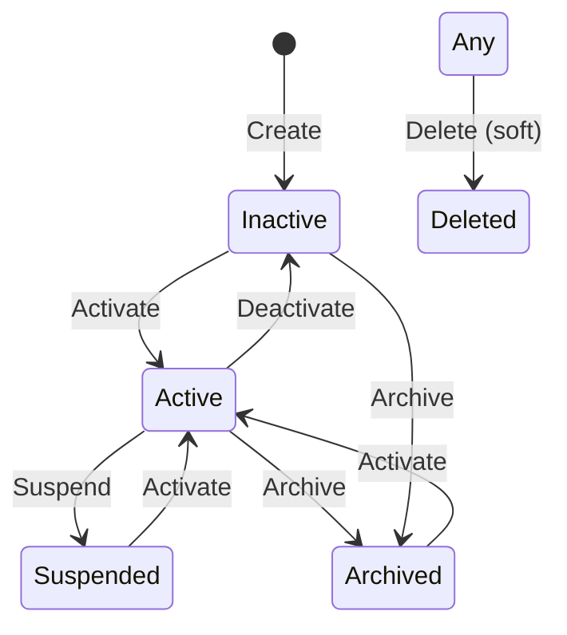

# Subscription Management

KHADAMATI subscription management allows administrators to create unlimited subscription plans with rich feature configuration, billing cycles, and lifecycle management.

## Overview

| Layer | Components |
|-------|------------|
| **Domain** | `SubscriptionPlan`, `PlanBillingOption`, `UserSubscription`, `PlanStatus`, `BillingCycle` |
| **Application** | DTOs, validators, MediatR commands/queries |
| **Infrastructure** | `SubscriptionPlanRepository`, `SubscriptionPlanService` |
| **API** | `AdminSubscriptionPlansController`, `SubscriptionPlansController` |

## Plan Fields

| Category | Fields |
|----------|--------|
| **Identity** | PlanCode, NameEn, NameAr, DescriptionEn, DescriptionAr |
| **Pricing** | Currency, BillingOptions (Monthly/Quarterly/SemiAnnual/Annual/Lifetime) |
| **Status** | Active, Inactive, Suspended, Archived |
| **Visibility** | DisplayPriority, SearchPriority, IsFeatured, HomePageVisible, BannerVisible, CategoryVisible |
| **Limits** | MaxCategories, MaxServices, MaxPhotos, MaxVideos, MaxAdvertisements, AdvertisementCredits, FeaturedDays |
| **Badges** | VerificationBadge, PremiumBadge |
| **Features** | StatisticsDashboard, Analytics, PriorityCustomerSupport |
| **Renewal** | RenewalReminder, AutoRenewal, ExpiryNotification, GracePeriodDays, TrialDays |
| **Pricing extras** | DiscountPercentage, CouponSupport, TaxRate, VatRate, PaymentRequired, PaymentMethods |
| **UI** | PlanColor, PlanIcon |

## Billing Cycles

| Cycle | Enum Value | Typical Duration |
|-------|------------|------------------|
| Monthly | `Monthly` | 30 days |
| Quarterly | `Quarterly` | 90 days |
| Semi Annual | `SemiAnnual` | 180 days |
| Annual | `Annual` | 365 days |
| Lifetime | `Lifetime` | 0 days (no expiry) |

## Administrator API (`/api/v1/admin/subscription-plans`)

Requires `Administrator` role (`AdminOnly` policy).

| Method | Endpoint | Description |
|--------|----------|-------------|
| GET | `/` | List plans (search, filter, paginate) |
| GET | `/{id}` | Get plan by ID |
| POST | `/` | Create plan |
| PUT | `/{id}` | Update plan |
| DELETE | `/{id}` | Soft-delete plan |
| POST | `/{id}/clone` | Clone plan |
| POST | `/{id}/activate` | Activate plan |
| POST | `/{id}/deactivate` | Deactivate plan |
| POST | `/{id}/suspend` | Suspend plan |
| POST | `/{id}/archive` | Archive plan |

### List Query Parameters

| Parameter | Type | Description |
|-----------|------|-------------|
| `search` | string | Search by code or name |
| `status` | string | Active, Inactive, Suspended, Archived |
| `targetRole` | string | Customer, Craftsman, Store, Administrator |
| `featured` | bool | Filter featured plans |
| `includeArchived` | bool | Include archived plans |
| `page` | int | Page number (default 1) |
| `pageSize` | int | Page size (default 20, max 100) |

### Create Plan Example

```json
POST /api/v1/admin/subscription-plans
Authorization: Bearer {admin_token}

{
  "planCode": "CRAFTSMAN_PRO",
  "nameEn": "Craftsman Pro",
  "nameAr": "حرفي احترافي",
  "descriptionEn": "Premium plan with priority listing",
  "currency": "SAR",
  "targetRole": "Craftsman",
  "status": "Active",
  "displayPriority": 10,
  "searchPriority": 8,
  "isFeatured": true,
  "homePageVisible": true,
  "maxServices": 25,
  "maxPhotos": 50,
  "verificationBadge": true,
  "premiumBadge": true,
  "statisticsDashboard": true,
  "analytics": true,
  "trialDays": 7,
  "vatRate": 15,
  "paymentRequired": true,
  "paymentMethods": ["Card", "Mada"],
  "planColor": "#2196F3",
  "billingOptions": [
    { "cycle": "Monthly", "price": 199, "durationDays": 30 },
    { "cycle": "Annual", "price": 1999, "durationDays": 365 }
  ]
}
```

## Public API (`/api/v1/subscription-plans`)

| Method | Endpoint | Auth | Description |
|--------|----------|------|-------------|
| GET | `/` | Anonymous | List active plans |
| GET | `/{id}` | Anonymous | Get plan details |

Query `?targetRole=Craftsman` to filter by role.

## Plan Lifecycle



## Database

- **EF Migration:** `SubscriptionManagement`
- **SQL Script:** `src/database/009_SubscriptionManagement.sql`
- **Tables:** `SubscriptionPlans`, `PlanBillingOptions`, `UserSubscriptions`

## Default Seed Plans

| Plan Code | Target | Monthly Price |
|-----------|--------|---------------|
| `CRAFTSMAN_BASIC` | Craftsman | 99 SAR |
| `STORE_PRO` | Store | 199 SAR |

## Tests

```bash
cd src/backend
dotnet test Khadamati.Tests/Khadamati.Tests.csproj
```

Covers validators and service flows: create, activate, clone, public listing.
