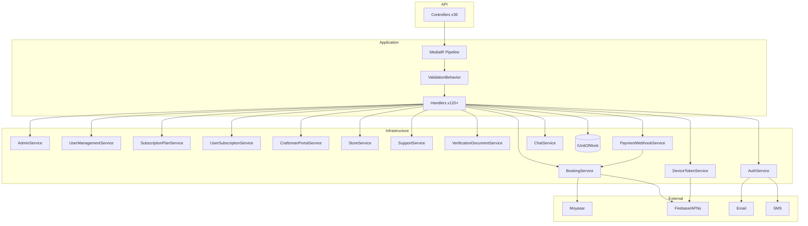

# API Dependency Map — Phase 0.5 Discovery

**Generated:** 2026-07-22  
**Flow:** `Controller → MediatR Command/Query → Handler → Service/Repository → Entity`

---

## Legend

- **M** = MediatR
- **S** = Service layer
- **R** = Direct repository (`IUnitOfWork`)
- **D** = Direct injection (no MediatR)

---

## Complete Endpoint Dependency Map

### Identity & Auth

```
POST   /api/v1/auth/register                          → M:RegisterCommand                    → S:AuthService
POST   /api/v1/auth/login                             → M:LoginCommand                       → S:AuthService
POST   /api/v1/auth/refresh                           → M:RefreshTokenCommand                → S:AuthService
POST   /api/v1/auth/revoke                            → M:RevokeTokenCommand                 → S:AuthService
POST   /api/v1/auth/forgot-password                   → M:ForgotPasswordCommand              → S:AuthService
POST   /api/v1/auth/reset-password                    → M:ResetPasswordCommand               → S:AuthService
POST   /api/v1/auth/change-password                   → M:ChangePasswordCommand              → S:AuthService
POST   /api/v1/auth/verify-email                      → M:VerifyEmailCommand                 → S:AuthService
POST   /api/v1/auth/resend-email-verification         → M:ResendEmailVerificationCommand     → S:AuthService
POST   /api/v1/auth/admin/verify-email                → M:AdminVerifyEmailCommand            → S:AuthService
POST   /api/v1/auth/phone/send-otp                    → M:SendPhoneOtpCommand                → S:AuthService
POST   /api/v1/auth/phone/verify-otp                  → M:VerifyPhoneOtpCommand              → S:AuthService
GET    /api/v1/auth/me                                → M:GetMyPermissionsQuery              → S:PermissionService
GET    /api/v1/auth/permissions                       → M:GetMyPermissionsQuery              → S:PermissionService

GET    /api/v1/sessions                               → M:GetSessionsQuery                   → S:SessionService
GET    /api/v1/sessions/user/{userId}                  → M:GetSessionsQuery                   → S:SessionService
DELETE /api/v1/sessions/{sessionId}                   → M:RevokeSessionCommand               → S:SessionService
DELETE /api/v1/sessions/others                        → M:RevokeAllOtherSessionsCommand      → S:SessionService
DELETE /api/v1/sessions                               → M:RevokeAllSessionsCommand           → S:SessionService

GET    /api/v1/profile                                → M:GetProfileQuery                    → S:ProfileService
PUT    /api/v1/profile                                → M:UpdateProfileCommand               → S:ProfileService

GET    /api/v1/login-history                          → M:GetLoginHistoryQuery               → S:LoginHistoryService
```

### Users

```
GET    /api/v1/users/me                               → M:GetUserProfileQuery                → R:IUnitOfWork<User>
PUT    /api/v1/users/me                               → M:UpdateUserProfileCommand           → R:IUnitOfWork<User>
POST   /api/v1/users/me/addresses                     → M:AddAddressCommand                  → R:IUnitOfWork<Address>
GET    /api/v1/users/me/addresses                     → M:GetMyAddressesQuery                → R:IUnitOfWork<Address>
PUT    /api/v1/users/me/addresses/{id}                → M:UpdateAddressCommand               → R:IUnitOfWork<Address>
DELETE /api/v1/users/me/addresses/{id}                → M:DeleteAddressCommand               → R:IUnitOfWork<Address>

GET    /api/v1/admin/users                            → M:SearchAdminUsersQuery              → S:UserManagementService
GET    /api/v1/admin/users/{id}                       → M:GetAdminUserByIdQuery              → S:UserManagementService
POST   /api/v1/admin/users                            → M:CreateAdminUserCommand             → S:UserManagementService
PUT    /api/v1/admin/users/{id}                      → M:UpdateAdminUserCommand             → S:UserManagementService
DELETE /api/v1/admin/users/{id}                      → M:DeleteAdminUserCommand             → S:UserManagementService
POST   /api/v1/admin/users/{id}/suspend               → M:SuspendUserCommand                 → S:UserManagementService
POST   /api/v1/admin/users/{id}/activate             → M:ActivateUserCommand                → S:UserManagementService
PUT    /api/v1/admin/users/{id}/roles                 → M:AssignUserRolesCommand             → S:UserManagementService
POST   /api/v1/admin/users/{id}/verify-email          → M:AdminVerifyUserEmailCommand        → S:AuthService
GET    /api/v1/admin/users/{id}/permissions           → M:GetUserPermissionMatrixQuery       → S:UserManagementService
PUT    /api/v1/admin/users/{id}/permissions           → M:UpdateUserPermissionsCommand       → S:UserManagementService
```

### Providers (Craftsmen)

```
GET    /api/v1/me/craftsman                           → M:GetMyCraftsmanProfileQuery         → S:CraftsmanPortalService
PUT    /api/v1/me/craftsman                           → M:UpdateMyCraftsmanProfileCommand    → S:CraftsmanPortalService
POST   /api/v1/me/craftsman/services                  → M:UpsertCraftsmanServiceCommand      → S:CraftsmanPortalService
DELETE /api/v1/me/craftsman/services/{id}             → M:DeleteCraftsmanServiceCommand      → S:CraftsmanPortalService
POST   /api/v1/me/craftsman/working-hours             → M:UpsertCraftsmanWorkingHourCommand  → S:CraftsmanPortalService
DELETE /api/v1/me/craftsman/working-hours/{id}        → M:DeleteCraftsmanWorkingHourCommand  → S:CraftsmanPortalService

GET    /api/v1/bookings/craftsmen                     → M:GetCraftsmenForServiceQuery        → S:BookingService
GET    /api/v1/bookings/craftsmen/nearby              → M:GetNearbyCraftsmenForServiceQuery  → S:BookingService
GET    /api/v1/bookings/availability                  → M:GetAvailableSlotsQuery             → S:BookingService
```

### Stores

```
GET    /api/v1/me/store                               → M:GetMyStoreProfileQuery             → S:StoreService
PUT    /api/v1/me/store                               → M:UpdateMyStoreProfileCommand        → S:StoreService
POST   /api/v1/me/store/products                      → M:UpsertStoreProductCommand          → S:StoreService
PUT    /api/v1/me/store/products/{id}                 → M:UpsertStoreProductCommand          → S:StoreService
DELETE /api/v1/me/store/products/{id}                 → M:DeleteStoreProductCommand          → S:StoreService
```

### Services (Catalog)

```
GET    /api/v1/services/categories                    → M:GetServiceCategoriesQuery          → R:IUnitOfWork<ServiceCategory>
GET    /api/v1/services                               → M:GetServicesQuery                   → R:IUnitOfWork<Service>

GET    /api/v1/admin/categories                       → M:ListCategoriesQuery                → S:AdminService
GET    /api/v1/admin/categories/{id}                  → M:GetCategoryQuery                   → S:AdminService
POST   /api/v1/admin/categories                       → M:CreateCategoryCommand              → S:AdminService
PUT    /api/v1/admin/categories/{id}                  → M:UpdateCategoryCommand              → S:AdminService
DELETE /api/v1/admin/categories/{id}                  → M:DeleteCategoryCommand              → S:AdminService

GET    /api/v1/admin/services                         → M:ListServicesQuery                  → S:AdminService
GET    /api/v1/admin/services/{id}                    → M:GetServiceQuery                    → S:AdminService
POST   /api/v1/admin/services                         → M:CreateServiceCommand               → S:AdminService
PUT    /api/v1/admin/services/{id}                   → M:UpdateServiceCommand               → S:AdminService
DELETE /api/v1/admin/services/{id}                   → M:DeleteServiceCommand               → S:AdminService
```

### Bookings

```
POST   /api/v1/bookings                               → M:CreateBookingCommand               → S:BookingService → E:ServiceRequest
GET    /api/v1/bookings/{id}                          → M:GetBookingQuery                    → S:BookingService
GET    /api/v1/bookings                                → M:ListBookingsQuery                  → S:BookingService
POST   /api/v1/bookings/{id}/confirm                  → M:ConfirmBookingCommand              → S:BookingService
POST   /api/v1/bookings/{id}/payment                  → M:InitiatePaymentCommand             → S:BookingService → S:MoyasarPaymentGateway
POST   /api/v1/bookings/{id}/payment/confirm          → M:ConfirmPaymentCommand              → S:BookingService
POST   /api/v1/bookings/{id}/accept                    → M:AcceptBookingCommand               → S:BookingService
POST   /api/v1/bookings/{id}/reject                    → M:RejectBookingCommand               → S:BookingService
POST   /api/v1/bookings/{id}/cancel                    → M:CancelBookingCommand               → S:BookingService
POST   /api/v1/bookings/{id}/complete                  → M:CompleteBookingCommand             → S:BookingService
POST   /api/v1/bookings/{id}/no-show                   → M:MarkNoShowCommand                  → S:BookingService
POST   /api/v1/bookings/{id}/reschedule                → M:RescheduleBookingCommand           → S:BookingService

GET    /api/v1/admin/bookings                         → M:AdminListBookingsQuery             → S:BookingService
GET    /api/v1/admin/bookings/stats                   → M:GetAdminBookingStatsQuery          → S:BookingService
GET    /api/v1/admin/bookings/{id}                    → M:AdminGetBookingQuery               → S:BookingService
```

### Payments

```
POST   /api/v1/bookings/{id}/payment                  → (see Bookings)                       → S:BookingService → S:IPaymentGateway
POST   /api/v1/bookings/{id}/payment/confirm          → (see Bookings)                       → S:BookingService
POST   /api/v1/webhooks/moyasar                       → M:ProcessMoyasarWebhookCommand       → S:PaymentWebhookService → S:BookingService
GET    /api/v1/admin/payments/{id}                    → M:GetAdminPaymentQuery               → S:AdminService → E:BookingPayment
```

### Subscriptions

```
GET    /api/v1/subscription-plans                     → M:GetPublicSubscriptionPlansQuery    → S:SubscriptionPlanService
GET    /api/v1/subscription-plans/{id}                 → M:GetSubscriptionPlanByIdQuery       → S:SubscriptionPlanService

GET    /api/v1/me/subscription                        → M:GetCurrentUserSubscriptionQuery    → S:UserSubscriptionService
GET    /api/v1/me/subscriptions                       → M:GetUserSubscriptionHistoryQuery    → S:UserSubscriptionService
POST   /api/v1/me/subscription                        → M:SubscribeCommand                   → S:UserSubscriptionService
POST   /api/v1/me/subscription/{id}/cancel            → M:CancelUserSubscriptionCommand      → S:UserSubscriptionService
PATCH  /api/v1/me/subscription/auto-renew             → M:UpdateAutoRenewCommand             → S:UserSubscriptionService

GET    /api/v1/admin/subscription-plans               → M:SearchSubscriptionPlansQuery       → S:SubscriptionPlanService
GET    /api/v1/admin/subscription-plans/{id}          → M:GetSubscriptionPlanByIdQuery       → S:SubscriptionPlanService
POST   /api/v1/admin/subscription-plans               → M:CreateSubscriptionPlanCommand      → S:SubscriptionPlanService
PUT    /api/v1/admin/subscription-plans/{id}          → M:UpdateSubscriptionPlanCommand      → S:SubscriptionPlanService
DELETE /api/v1/admin/subscription-plans/{id}          → M:DeleteSubscriptionPlanCommand      → S:SubscriptionPlanService
POST   /api/v1/admin/subscription-plans/{id}/clone    → M:CloneSubscriptionPlanCommand       → S:SubscriptionPlanService
POST   /api/v1/admin/subscription-plans/{id}/activate → M:ActivateSubscriptionPlanCommand    → S:SubscriptionPlanService
POST   /api/v1/admin/subscription-plans/{id}/deactivate→ M:DeactivateSubscriptionPlanCommand  → S:SubscriptionPlanService
POST   /api/v1/admin/subscription-plans/{id}/suspend  → M:SuspendSubscriptionPlanCommand     → S:SubscriptionPlanService
POST   /api/v1/admin/subscription-plans/{id}/archive  → M:ArchiveSubscriptionPlanCommand     → S:SubscriptionPlanService

GET    /api/v1/admin/user-subscriptions               → M:SearchAdminUserSubscriptionsQuery  → S:UserSubscriptionService
GET    /api/v1/admin/user-subscriptions/{id}          → M:GetAdminUserSubscriptionByIdQuery  → S:UserSubscriptionService
POST   /api/v1/admin/user-subscriptions/users/{userId}→ M:GrantUserSubscriptionCommand       → S:UserSubscriptionService
POST   /api/v1/admin/user-subscriptions/{id}/cancel   → M:CancelAdminUserSubscriptionCommand → S:UserSubscriptionService
```

### Marketing

```
GET    /api/v1/coupons/validate                       → M:ValidateCouponQuery                → S:CouponService
GET    /api/v1/advertisements                         → M:GetActiveAdsQuery                  → S:SupportService

GET    /api/v1/admin/coupons                          → M:ListCouponsQuery                   → S:AdminService
GET    /api/v1/admin/coupons/{id}                     → M:GetCouponQuery                     → S:AdminService
POST   /api/v1/admin/coupons                          → M:CreateCouponCommand                → S:AdminService
PUT    /api/v1/admin/coupons/{id}                     → M:UpdateCouponCommand                → S:AdminService
DELETE /api/v1/admin/coupons/{id}                     → M:DeleteCouponCommand                → S:AdminService

GET    /api/v1/admin/advertisements                   → M:ListAdvertisementsQuery            → S:AdminService
GET    /api/v1/admin/advertisements/{id}              → M:GetAdvertisementQuery              → S:AdminService
POST   /api/v1/admin/advertisements                   → M:CreateAdvertisementCommand         → S:AdminService
PUT    /api/v1/admin/advertisements/{id}              → M:UpdateAdvertisementCommand         → S:AdminService
DELETE /api/v1/admin/advertisements/{id}              → M:DeleteAdvertisementCommand         → S:AdminService
```

### Notifications & Messaging

```
GET    /api/v1/notifications                          → M:GetNotificationsQuery              → S:BookingService → E:Notification
POST   /api/v1/notifications/{id}/read                → M:MarkNotificationReadCommand        → S:BookingService

POST   /api/v1/devices/push-token                    → M:RegisterPushTokenCommand           → S:DeviceTokenService
DELETE /api/v1/devices/push-token                    → M:UnregisterPushTokenCommand         → S:DeviceTokenService

GET    /api/v1/chat/conversations                    → M:GetMyChatConversationsQuery        → S:ChatService
GET    /api/v1/chat/bookings/{bookingId}             → M:GetBookingChatConversationQuery    → S:ChatService
GET    /api/v1/chat/conversations/{id}/messages       → M:GetChatMessagesQuery               → S:ChatService
POST   /api/v1/chat/conversations/{id}/messages       → M:SendChatMessageCommand             → S:ChatService
```

### Locations

```
GET    /api/v1/locations/regions                     → M:ListRegionsQuery                   → S:AdminService
GET    /api/v1/locations/cities                      → M:ListCitiesQuery                    → S:AdminService

GET/POST/PUT/DELETE /api/v1/admin/regions/*           → M:Region *Commands/Queries           → S:AdminService
GET/POST/PUT/DELETE /api/v1/admin/cities/*            → M:City *Commands/Queries             → S:AdminService
```

### Verification

```
POST   /api/v1/verification/documents                 → M:SubmitVerificationDocumentCommand  → S:VerificationDocumentService
GET    /api/v1/admin/verification-documents          → M:ListVerificationDocumentsQuery     → S:VerificationDocumentService
GET    /api/v1/admin/verification-documents/{id}      → M:GetVerificationDocumentQuery       → S:VerificationDocumentService
POST   /api/v1/admin/verification-documents/{id}/approve → M:ApproveVerificationDocumentCommand → S:VerificationDocumentService
POST   /api/v1/admin/verification-documents/{id}/reject  → M:RejectVerificationDocumentCommand  → S:VerificationDocumentService
```

### Support

```
POST   /api/v1/complaints                             → M:CreateComplaintCommand             → S:SupportService
GET    /api/v1/complaints/mine                        → M:GetMyComplaintsQuery               → S:SupportService
POST   /api/v1/support-tickets                        → M:CreateSupportTicketCommand         → S:SupportService
GET    /api/v1/support-tickets/mine                   → M:GetMySupportTicketsQuery           → S:SupportService
POST   /api/v1/bookings/{id}/review                   → M:SubmitBookingReviewCommand         → S:SupportService → S:BookingService

GET    /api/v1/admin/complaints/{id}                  → M:GetAdminComplaintQuery             → S:AdminService
POST   /api/v1/admin/complaints/{id}/resolve          → M:ResolveAdminComplaintCommand       → S:AdminService
GET    /api/v1/admin/support-tickets/{id}             → M:GetAdminSupportTicketQuery         → S:AdminService
POST   /api/v1/admin/support-tickets/{id}/close       → M:CloseAdminSupportTicketCommand     → S:AdminService
```

### Administration

```
GET    /api/v1/admin/dashboard                        → M:GetAdminDashboardQuery             → S:AdminService
GET    /api/v1/admin/{module}                         → M:ListAdminModuleQuery               → S:AdminService
POST   /api/v1/admin/{module}/bulk                    → M:AdminBulkActionCommand             → S:AdminService
GET    /api/v1/admin/{module}/export                  → M:ExportAdminModuleQuery             → S:AdminService → S:AdminExportService
GET    /api/v1/admin/analytics/data                   → M:GetAdminAnalyticsQuery             → S:AdminService
GET    /api/v1/admin/reports/list                     → M:GetAdminReportsQuery               → S:AdminService
POST   /api/v1/admin/reports/generate                 → M:GenerateAdminReportCommand         → S:AdminService → S:AdminExportService
GET    /api/v1/admin/system/health                    → M:GetAdminSystemHealthQuery          → S:AdminService
GET    /api/v1/admin/backup/list                      → M:ListAdminBackupsQuery              → S:AdminService
POST   /api/v1/admin/backup/create                    → M:CreateAdminBackupCommand           → S:AdminService → S:DatabaseBackupService
POST   /api/v1/admin/backup/restore                   → M:RestoreAdminBackupCommand          → S:AdminService → S:DatabaseBackupService
GET    /api/v1/admin/backup/{id}/download             → M:DownloadAdminBackupQuery           → S:AdminService + S:DatabaseBackupService

GET    /api/v1/admin/settings                         → M:ListSystemSettingsQuery            → S:AdminService
PUT    /api/v1/admin/settings/{id}                    → M:UpdateSystemSettingCommand         → S:AdminService

GET    /api/v1/admin/rbac/roles                       → M:ListRbacRolesQuery                 → S:AdminService
GET    /api/v1/admin/rbac/roles/{roleId}/permissions  → M:GetRolePermissionMatrixQuery       → S:AdminService
PUT    /api/v1/admin/rbac/roles/{roleId}/permissions  → M:UpdateRolePermissionsCommand       → S:AdminService
```

### Health (Direct — no MediatR)

```
GET    /api/v1/health                                 → D:inline
GET    /api/v1/health/ready                           → D:ApplicationDbContext
GET    /api/v1/health/integrations                    → D:IntegrationReadinessService
```

---

## Service Fan-In (how many endpoint groups depend on each service)

| Service | Endpoint groups | Notes |
|---------|-----------------|-------|
| **AdminService** | 12+ | Dashboard, modules, catalog, locations, marketing, ops, RBAC, settings, backups, public locations |
| **BookingService** | 3 | Bookings, notifications, craftsman discovery |
| **AuthService** | 2 | Auth + admin user email verify |
| **UserManagementService** | 1 | Admin users |
| **SubscriptionPlanService** | 2 | Public + admin plans |
| **UserSubscriptionService** | 2 | Me + admin subscriptions |
| **SupportService** | 2 | User support + public ads |
| **IUnitOfWork** (direct) | 2 | Users profile/addresses, public services |

---

## External Integration Dependencies

```
BookingService.InitiatePaymentAsync
  └── IPaymentGateway
        ├── MoyasarPaymentGateway (production)
        └── DevelopmentPaymentGateway (dev)

PaymentWebhookService.ProcessMoyasarWebhookAsync
  └── BookingService.ConfirmPaymentFromWebhookAsync

AuthService
  ├── IEmailSender (EmailProviders)
  └── ISmsSender (SmsProviders)

BookingService (notifications)
  └── IPushNotificationService
        ├── FirebasePushNotificationService
        └── DevelopmentPushNotificationService

DeviceTokenService
  └── FirebasePushNotificationService / ApnsPushNotificationSender

HealthController
  └── IntegrationReadinessService (reports Moyasar, Firebase, email, SMS config status)
```

---

## MediatR Command/Query Catalog (by Feature folder)

| Feature folder | Commands | Queries | Handler target |
|----------------|----------|---------|----------------|
| `Auth/Commands` | 11 | 0 | AuthService |
| `Identity/Commands` | 8 | 4 | Session/Profile/LoginHistory/Auth/Permission services |
| `Users/Queries` | 4 | 2 | IUnitOfWork |
| `Users/Commands` | 8 | 1 | UserManagementService, AuthService |
| `Services/Queries` | 0 | 2 | IUnitOfWork |
| `Bookings/Commands` | 15 | 5 | BookingService |
| `Craftsman` | 5 | 1 | CraftsmanPortalService |
| `Store` | 3 | 1 | StoreService |
| `Subscriptions/Commands` | 12 | 0 | SubscriptionPlanService, UserSubscriptionService |
| `Subscriptions/Queries` | 0 | 6 | SubscriptionPlanService, UserSubscriptionService |
| `Verification` | 3 | 2 | VerificationDocumentService |
| `Support` | 4 | 3 | SupportService, CouponService |
| `Messaging` | 2 | 4 | DeviceTokenService, ChatService |
| `Payments/Commands` | 1 | 0 | PaymentWebhookService |
| `Admin/Commands` | 30+ | 15+ | AdminService |

**Registration:** `Khadamati.Application/DependencyInjection.cs` — assembly scan + `ValidationBehavior<,>`

---

## Dependency Graph (Mermaid)


