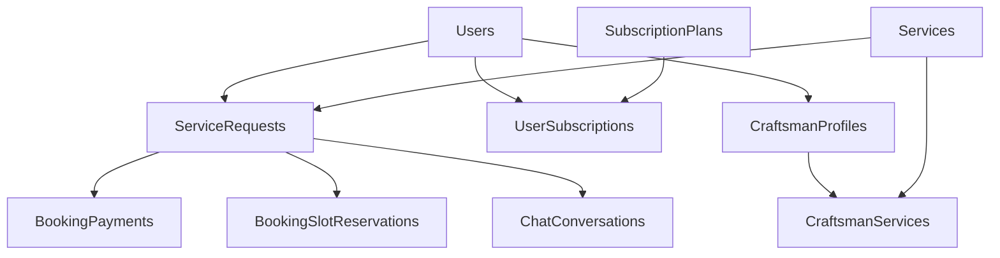

# KHADAMATI — Database Dependency Graph (Phase 0.5)

**Document version:** 1.0  
**Date:** 2026-07-22

---

## 1. Purpose

Maps **table dependencies** to **dependent tables** and **business modules** affected by schema changes. Use before migrations, deletes, or archival.

---

## 2. Hub Tables (Highest Fan-In)

| Rank | Table | Incoming FKs | Blast Radius |
|------|-------|--------------|--------------|
| 1 | **Users** | 22 | Identity, Bookings, Payments, Subscriptions, Messaging, Support, Verification |
| 2 | **ServiceRequests** | 7 | Bookings, Payments, Chat, Reviews (embedded), Admin analytics |
| 3 | **Roles** | 4 | RBAC, Admin user management |
| 4 | **Permissions** | 2 | RBAC, Admin authorization |
| 5 | **SubscriptionPlans** | 2 | Subscriptions, Billing |
| 6 | **ServiceCategories** | 2 | Catalog, Bookings |
| 7 | **Regions** | 1 | Locations, Registration, Profile |

---

## 3. Dependency Chains by Table

### Users
```
Users
 ↓ (Cascade)
 UserProfiles, CraftsmanProfiles, StoreProfiles, RefreshTokens,
 EmailVerificationTokens, PasswordResetTokens, PhoneOtpTokens,
 PasswordHistory, UserRoles, UserPermissions, DevicePushTokens,
 Notifications, Complaints, SupportTickets
 ↓ (Restrict)
 ServiceRequests (CustomerId, CraftsmanId), BookingPayments (Payer/Payee),
 UserSubscriptions, VerificationDocuments, ChatMessages (Sender)
 ↓ (SetNull)
 LoginHistory, SecurityLogs, ServiceRequestStatusHistories.ChangedByUserId,
 Users.PrimaryRoleId
```
**Modules affected:** Identity, Users, Providers, Stores, Bookings, Payments, Subscriptions, Notifications, Messaging, Support, Verification, Administration

---

### ServiceRequests (Bookings)
```
ServiceRequests
 ↓ (Cascade)
 BookingPayments, BookingSlotReservations, ServiceRequestStatusHistories,
 ChatConversations → ChatMessages
 ↓ (Restrict)
 RescheduledFromId (self-reference)
 ↓ (SetNull)
 AddressId
```
**Modules affected:** Bookings, Payments, Messaging, Marketing (reviews), Administration (dashboard, reports)

---

### ServiceCategories / Services
```
ServiceCategories
 ↓ (Cascade)
 Services → CraftsmanServices
 ↓ (Restrict)
 ServiceRequests.ServiceId
```
**Modules affected:** Services catalog, Bookings, Provider portal, Admin catalog

---

### SubscriptionPlans
```
SubscriptionPlans
 ↓ (Cascade)
 PlanBillingOptions
 ↓ (Restrict)
 UserSubscriptions.PlanId
```
**Modules affected:** Subscriptions, Administration (plans, user subscriptions)

---

### Regions / Cities
```
Regions
 ↓ (Cascade)
 Cities
```
**Modules affected:** Locations, Registration (region/city pickers), Profile, Admin locations

---

### Roles / Permissions (RBAC)
```
Roles
 ↓ (Cascade)
 RolePermissions, UserRoles
 ↓ (SetNull)
 Users.PrimaryRoleId

Permissions
 ↓ (Cascade)
 RolePermissions, UserPermissions
```
**Modules affected:** Identity, Administration (RBAC, user permissions)

---

## 4. Module → Table Map

| Business Module | Primary Tables | Dependent Tables |
|-----------------|----------------|------------------|
| **Identity** | Users, RefreshTokens, EmailVerificationTokens, PasswordResetTokens, PhoneOtpTokens, PasswordHistory, LoginHistory, SecurityLogs | Roles, UserRoles, UserPermissions |
| **Users** | UserProfiles, Addresses | Users, Regions, Cities |
| **Providers (Craftsmen)** | CraftsmanProfiles, CraftsmanServices, CraftsmanWorkingHours | Users, Services |
| **Stores** | StoreProfiles, StoreProducts | Users |
| **Services** | ServiceCategories, Services | — |
| **Bookings** | ServiceRequests, BookingSlotReservations, ServiceRequestStatusHistories | Users, Services, Addresses |
| **Payments** | BookingPayments | ServiceRequests, Users |
| **Subscriptions** | SubscriptionPlans, PlanBillingOptions, UserSubscriptions | Users |
| **Marketing** | Advertisements, Coupons | Users (ads target), ServiceRequests (reviews on entity) |
| **Notifications** | Notifications, DevicePushTokens | Users |
| **Messaging** | ChatConversations, ChatMessages | ServiceRequests, Users |
| **Locations** | Regions, Cities | — |
| **Verification** | VerificationDocuments | Users |
| **Support** | Complaints, SupportTickets | Users, ServiceRequests (optional) |
| **Administration** | SystemSettings, ActivityLogs, BackupJobs, AuditLogs | All aggregates |

---

## 5. Delete / Migration Impact Matrix

| If you change… | These break first… | Recommended order |
|----------------|---------------------|-------------------|
| `Users` schema | 22 child tables | Migrate children or use soft-delete only |
| `ServiceRequests.Status` enum | BookingService, status history, notifications | Coordinate app + migration |
| `Roles` / `Permissions` | JWT claims, admin UI, `[HasPermission]` | Seed + cache invalidation |
| `SubscriptionPlans` | Active UserSubscriptions | Deactivate plans before schema change |
| `BookingSlotReservations` unique filter | Double-booking prevention | Test concurrency under load |
| Remove `Coupons` | SupportController validate, SubscribePage | Feature flag first |

---

## 6. Cross-Module Critical Paths



---

## 7. SQL Script Dependencies (Legacy — Not EF)

Legacy objects depend on **different** table/column names:

| SQL Object | Depends on | EF Equivalent | Status |
|------------|------------|---------------|--------|
| `vw_PaymentSummary` | `dbo.Payments` | `BookingPayments` | **Broken if SQL deployed** |
| `vw_DashboardMetrics` | Payments, Reviews | BookingPayments, embedded review on ServiceRequests | **Drift** |
| `sp_GetNearbyCraftsmen` | Addresses geo, CraftsmanProfiles | BookingService C# query | **App uses C#, not SP** |
| `sp_UpdateServiceRequestStatus` | `RequestStatusId` FK | `Status` enum int | **Incompatible** |
| `TR_ServiceRequests_StatusHistory` | `RequestStatusId` | EF writes history in service | **Duplicate logic** |

---

## 8. Related Documents

- [DATABASE_ER_MODEL.md](./DATABASE_ER_MODEL.md)
- [DATABASE_OBJECT_INVENTORY.md](./DATABASE_OBJECT_INVENTORY.md)
- [../DATABASE_BASELINE.md](../DATABASE_BASELINE.md)
