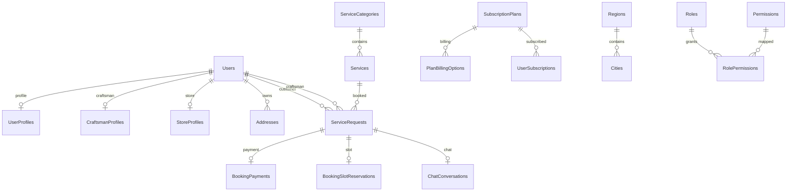

# KHADAMATI — Database ER Model (Phase 0.5)

**Document version:** 1.0  
**Date:** 2026-07-22  
**Authority:** EF Core `ApplicationDbContextModelSnapshot` (44 tables, schema `dbo`)

---

## 1. Conventions

| Aspect | Rule |
|--------|------|
| Primary key | `Guid Id` (except `AuditLog`, `LoginHistory`, `SecurityLog` → `bigint` identity) |
| Soft delete | `IsDeleted`, `DeletedAt`, `DeletedBy` on `BaseEntity` + global query filter |
| Audit | `CreatedAt`, `UpdatedAt`, `CreatedBy`, `UpdatedBy` |
| Enums | Stored as `int` (no `ref.*` lookup FKs) |
| Schema | All tables in `dbo` |

**OnDelete legend:** `Cascade` · `Restrict` · `SetNull` · `NoAction`

---

## 2. Entity Reference (All 44 Tables)

### 2.1 Users — `Users`

| Attribute | Value |
|-----------|-------|
| **PK** | `Id` (Guid) |
| **Unique** | `Email`, `Phone` |
| **Indexes** | `PrimaryRoleId` |
| **FK out** | `PrimaryRoleId` → `Roles` (**SetNull**) |
| **FK in** | 22 dependent relationships (hub entity) |
| **Navigation** | `PrimaryRole`, `Profile`, `CraftsmanProfile`, `StoreProfile`, `Addresses`, `RefreshTokens`, token collections, `UserRoles`, `DirectPermissions`, `PasswordHistories`, `LoginHistories`, `CustomerRequests`, `AssignedRequests` |
| **Enum columns** | `Role`, `Status`, `VerificationStatus`, `SubscriptionStatus` |

---

### 2.2 UserProfiles — `UserProfiles`

| Attribute | Value |
|-----------|-------|
| **PK** | `Id` (Guid) |
| **Unique** | `UserId` |
| **FK** | `UserId` → `Users` (**Cascade**, 1:1) |
| **Navigation** | `User` |
| **Notes** | `FullName` computed (ignored in EF); lat/long precision configured |

---

### 2.3 Addresses — `Addresses`

| Attribute | Value |
|-----------|-------|
| **PK** | `Id` (Guid) |
| **Indexes** | `UserId` |
| **FK** | `UserId` → `Users` (**Restrict**) |
| **Navigation** | `User` |
| **Referenced by** | `ServiceRequests.AddressId` (**SetNull**) |

---

### 2.4 RefreshTokens — `RefreshTokens`

| Attribute | Value |
|-----------|-------|
| **PK** | `Id` (Guid) |
| **Unique** | `Token` |
| **Indexes** | `UserId`, `DeviceId` |
| **FK** | `UserId` → `Users` (**Cascade**) |
| **Navigation** | `User` |

---

### 2.5 EmailVerificationTokens — `EmailVerificationTokens`

| PK | `Id` | **FK** | `UserId` → `Users` (**Cascade**) |
| **Indexes** | `UserId`, `ExpiresAt` |

---

### 2.6 PasswordResetTokens — `PasswordResetTokens`

| PK | `Id` | **FK** | `UserId` → `Users` (**Cascade**) |
| **Indexes** | `UserId`, `ExpiresAt` |

---

### 2.7 PhoneOtpTokens — `PhoneOtpTokens`

| PK | `Id` | **FK** | `UserId` → `Users` (**Cascade**) |
| **Indexes** | `(UserId, Phone)`, `ExpiresAt` |

---

### 2.8 PasswordHistory — `PasswordHistory`

| PK | `Id` | **FK** | `UserId` → `Users` (**Cascade**) |
| **Indexes** | `(UserId, ChangedAt)` |

---

### 2.9 Roles — `Roles`

| Attribute | Value |
|-----------|-------|
| **PK** | `Id` (Guid) |
| **Unique** | `Name` |
| **FK in** | `Users.PrimaryRoleId`, `UserRoles`, `RolePermissions` |
| **Navigation** | `UserRoles`, `RolePermissions` |

---

### 2.10 Permissions — `Permissions`

| PK | `Id` | **Unique** | `Code` |
| **FK in** | `RolePermissions`, `UserPermissions` |

---

### 2.11 RolePermissions — `RolePermissions`

| PK | `Id` | **Unique** | `(RoleId, PermissionId)` |
| **FK** | `RoleId` → `Roles` (**Cascade**), `PermissionId` → `Permissions` (**Cascade**) |

---

### 2.12 UserRoles — `UserRoles` (entity: `UserRoleAssignment`)

| PK | `Id` | **Unique** | `(UserId, RoleId)` |
| **FK** | `UserId` → `Users` (**Cascade**), `RoleId` → `Roles` (**Cascade**) |

---

### 2.13 UserPermissions — `UserPermissions`

| PK | `Id` | **Unique** | `(UserId, PermissionId)` |
| **FK** | `UserId` → `Users` (**Cascade**), `PermissionId` → `Permissions` (**Cascade**) |

---

### 2.14 LoginHistory — `LoginHistory`

| PK | `Id` (bigint identity) |
| **Indexes** | `Email`, `(UserId, LoginAt)` |
| **FK** | `UserId` → `Users` (**SetNull**) |

---

### 2.15 SecurityLogs — `SecurityLogs`

| PK | `Id` (bigint identity) |
| **Indexes** | `CreatedAt`, `EventType`, `UserId` |
| **FK** | `UserId` → `Users` (**SetNull**) |

---

### 2.16 AuditLogs — `AuditLogs`

| PK | `Id` (bigint identity) |
| **Indexes** | `CreatedAt`, `TableName` |
| **FK** | None |
| **Note** | Simpler than SQL `audit.AuditLogs` schema |

---

### 2.17 ServiceCategories — `ServiceCategories`

| PK | `Id` |
| **Indexes** | `ParentCategoryId` |
| **FK** | `ParentCategoryId` → `ServiceCategories` (**NoAction**, self-ref) |
| **Navigation** | `ParentCategory`, `SubCategories`, `Services` |

---

### 2.18 Services — `Services`

| PK | `Id` |
| **Indexes** | `CategoryId` |
| **FK** | `CategoryId` → `ServiceCategories` (**Cascade**) |
| **Navigation** | `Category`, `CraftsmanServices`, `Requests` |

---

### 2.19 CraftsmanProfiles — `CraftsmanProfiles`

| PK | `Id` | **Unique** | `UserId` |
| **FK** | `UserId` → `Users` (**Cascade**, 1:1) |
| **Navigation** | `User`, `Services` (CraftsmanService) |

---

### 2.20 CraftsmanServices — `CraftsmanServices`

| PK | `Id` | **Unique** | `(CraftsmanProfileId, ServiceId)` |
| **FK** | `CraftsmanProfileId` → `CraftsmanProfiles` (**Cascade**), `ServiceId` → `Services` (**Cascade**) |

---

### 2.21 CraftsmanWorkingHours — `CraftsmanWorkingHours`

| PK | `Id` |
| **Indexes** | `(CraftsmanId, DayOfWeek)` |
| **FK** | `CraftsmanId` → `Users` (**Cascade**) |

---

### 2.22 StoreProfiles — `StoreProfiles`

| PK | `Id` | **Unique** | `UserId` |
| **FK** | `UserId` → `Users` (**Cascade**, 1:1) |
| **Navigation** | `User`, `Products` |

---

### 2.23 StoreProducts — `StoreProducts`

| PK | `Id` |
| **Indexes** | `StoreProfileId` |
| **FK** | `StoreProfileId` → `StoreProfiles` (**Cascade**) |

---

### 2.24 ServiceRequests — `ServiceRequests` (bookings)

| Attribute | Value |
|-----------|-------|
| **PK** | `Id` (Guid) |
| **Unique** | `BookingReference` |
| **Indexes** | `AddressId`, `CraftsmanId`, `CustomerId`, `RescheduledFromId`, `ScheduledAt`, `ServiceId`, `Status` |
| **FK** | `CustomerId` → `Users` (**Restrict**), `CraftsmanId` → `Users` (**Restrict**), `ServiceId` → `Services` (**Restrict**), `AddressId` → `Addresses` (**SetNull**), `RescheduledFromId` → `ServiceRequests` (**Restrict**) |
| **Navigation** | `Customer`, `Service`, `Craftsman`, `Address`, `RescheduledFrom`, `Payment`, `SlotReservation`, `StatusHistory` |
| **Enum** | `Status` |
| **Concurrency** | ❌ No `rowversion` |

---

### 2.25 ServiceRequestStatusHistories — `ServiceRequestStatusHistories`

| PK | `Id` |
| **Indexes** | `ServiceRequestId`, `ChangedByUserId` |
| **FK** | `ServiceRequestId` → `ServiceRequests` (**Cascade**), `ChangedByUserId` → `Users` (**SetNull**) |
| **Enums** | `OldStatus`, `NewStatus` |

---

### 2.26 BookingPayments — `BookingPayments`

| PK | `Id` | **Unique** | `ServiceRequestId` (1:1) |
| **Indexes** | `PayerUserId`, `PayeeUserId` |
| **FK** | `ServiceRequestId` → `ServiceRequests` (**Cascade**), `PayerUserId` → `Users` (**Restrict**), `PayeeUserId` → `Users` (**Restrict**) |
| **Enum** | `Status` |
| **SQL alias** | Legacy scripts use `dbo.Payments` |

---

### 2.27 BookingSlotReservations — `BookingSlotReservations`

| PK | `Id` | **Unique** | `ServiceRequestId` (1:1); filtered `(CraftsmanId, SlotStart)` WHERE `IsActive=1 AND IsDeleted=0` |
| **FK** | `ServiceRequestId` → `ServiceRequests` (**Cascade**), `CraftsmanId` → `Users` (**Cascade**) |

---

### 2.28 SubscriptionPlans — `SubscriptionPlans`

| PK | `Id` | **Unique** | `PlanCode` |
| **Indexes** | `Status`, `TargetRole`, `DisplayPriority` |
| **Enums** | `TargetRole`, `Status` |

---

### 2.29 PlanBillingOptions — `PlanBillingOptions`

| PK | `Id` | **Unique** | `(PlanId, Cycle)` |
| **FK** | `PlanId` → `SubscriptionPlans` (**Cascade**) |
| **Enum** | `Cycle` |

---

### 2.30 UserSubscriptions — `UserSubscriptions`

| PK | `Id` |
| **Indexes** | `UserId`, `PlanId`, `BillingOptionId` |
| **FK** | `UserId` → `Users` (**Restrict**), `PlanId` → `SubscriptionPlans` (**Restrict**), `BillingOptionId` → `PlanBillingOptions` (**NoAction**) |
| **Enum** | `Status` |

---

### 2.31 Notifications — `Notifications`

| PK | `Id` |
| **Indexes** | `(UserId, IsRead)` |
| **FK** | `UserId` → `Users` (**Cascade**) |

---

### 2.32 DevicePushTokens — `DevicePushTokens`

| PK | `Id` | **Unique** | `(UserId, Token)` |
| **FK** | `UserId` → `Users` (**Cascade**) |
| **EF-only** | Not in legacy SQL scripts |

---

### 2.33 ChatConversations — `ChatConversations`

| PK | `Id` | **Unique** | `BookingId` |
| **FK** | `BookingId` → `ServiceRequests` (**Cascade**) |
| **EF-only** | Not in legacy SQL scripts |

---

### 2.34 ChatMessages — `ChatMessages`

| PK | `Id` |
| **Indexes** | `SenderId`, `(ConversationId, SentAt)` |
| **FK** | `ConversationId` → `ChatConversations` (**Cascade**), `SenderId` → `Users` (**Restrict**) |

---

### 2.35 Regions — `Regions`

| PK | `Id` | **Unique** | `Code` |
| **Navigation** | `Cities` |

---

### 2.36 Cities — `Cities`

| PK | `Id` |
| **Indexes** | `RegionId` |
| **FK** | `RegionId` → `Regions` (**Cascade**) |

---

### 2.37 Advertisements — `Advertisements`

| PK | `Id` | **FK** | None (optional `TargetUserId` scalar, no FK configured) |

---

### 2.38 Coupons — `Coupons`

| PK | `Id` | **Unique** | `Code` |

---

### 2.39 Complaints — `Complaints`

| PK | `Id` |
| **Indexes** | `ComplainantUserId` |
| **FK** | `ComplainantUserId` → `Users` (**Cascade**) |

---

### 2.40 SupportTickets — `SupportTickets`

| PK | `Id` | **Unique** | `TicketNumber` |
| **Indexes** | `UserId` |
| **FK** | `UserId` → `Users` (**Cascade**) |

---

### 2.41 VerificationDocuments — `VerificationDocuments`

| PK | `Id` |
| **Indexes** | `(UserId, Status)`, `ReviewedByUserId` |
| **FK** | `UserId` → `Users` (**Restrict**), `ReviewedByUserId` → `Users` (**Restrict**) |
| **Column** | `Status` mapped to `VerificationStatusId` |

---

### 2.42 SystemSettings — `SystemSettings`

| PK | `Id` | **Unique** | `SettingKey` |

---

### 2.43 ActivityLogs — `ActivityLogs`

| PK | `Id` |
| **Indexes** | `CreatedAt` |

---

### 2.44 BackupJobs — `BackupJobs`

| PK | `Id` | **Indexes** | None beyond PK |

---

## 3. Relationship Summary

| OnDelete | Count | Examples |
|----------|-------|----------|
| **Cascade** | 30 | User child tokens, chat messages, plan billing options |
| **Restrict** | 11 | ServiceRequests ↔ Users, BookingPayments payers |
| **SetNull** | 5 | LoginHistory, SecurityLogs, ServiceRequest address |
| **NoAction** | 4 | Category parent, UserSubscription billing option |

---

## 4. ER Diagram (Core Domains)

---

## 5. Related Documents

- [DATABASE_DEPENDENCY_GRAPH.md](./DATABASE_DEPENDENCY_GRAPH.md)
- [DATABASE_OBJECT_INVENTORY.md](./DATABASE_OBJECT_INVENTORY.md)
- [DATABASE_INDEX_ANALYSIS.md](./DATABASE_INDEX_ANALYSIS.md)
- [../DATABASE_BASELINE.md](../DATABASE_BASELINE.md)
