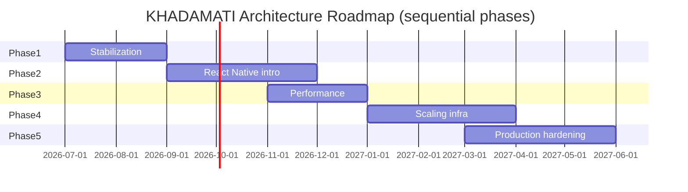

# KHADAMATI — Enterprise Architecture Roadmap

**Document type:** Migration and evolution roadmap  
**Status:** Draft — awaiting approval  
**Horizon:** MVP launch through production hardening and scale

---

## Roadmap principles

1. **API-first** — mobile technology may change; the REST API is the contract.
2. **Stabilize before migrate** — do not rewrite mobile while core booking integrity is unresolved.
3. **Scale infrastructure before scale marketing** — Redis and indexes before ad spend.
4. **No big-bang releases** — parallel run native + RN if migrating.
5. **Documentation gates** — each phase ends with updated docs and load test evidence.

---

## Phase overview

*Timeline is indicative — phases may overlap where teams are independent.*

---

## Phase 1 — Current architecture stabilization

**Goal:** Production-ready MVP on existing stack (.NET 8, React web, native mobile).

### Backend

| Item | Priority | Status |
|------|----------|--------|
| .NET 8 LTS on `main` | P0 | In progress (`cursor/dotnet8-usd-lebanon-7b80`) |
| Booking integrity (RowVersion, slot locks) | P0 | Planned (Phase 1A) |
| Mobile login role policy (block admin) | P0 | Analysis complete — pending approval |
| FluentValidation on all write DTOs | P1 | Partial |
| Integration test coverage for bookings/geo | P1 | Gaps identified |
| OpenAPI export for client codegen | P1 | Swagger exists |

### Web

| Item | Priority |
|------|----------|
| Admin portal permission migration complete | P1 |
| Customer booking flow parity with mobile | P1 |
| RTL/Arabic QA | P1 |

### Mobile (native — current)

| Item | Priority |
|------|----------|
| Ship MVP on Kotlin + Swift if launch is imminent | P0 decision |
| Close gaps: verification upload, working hours UI | P1 |
| Mobile scope enforcement (no admin) | P0 |

### Infrastructure

| Item | Priority |
|------|----------|
| Staging environment operational | P0 |
| Production secrets via vault | P0 |
| Disable demo seeding in production | P0 |

### Exit criteria

- [ ] API passes integration test suite
- [ ] Load test: 500 CCU sustained 30 min
- [ ] Security review (auth, RBAC, payments)
- [ ] Mobile apps on TestFlight + Play Internal Testing
- [ ] Documentation: mobile scope, API inventory updated

### Deliverables

- Stabilized `main` branch on .NET 8
- MVP launch candidate (native mobile OR deferred per business decision)

---

## Phase 2 — React Native introduction

**Goal:** Bootstrap unified mobile client; achieve auth + core read paths.

**Prerequisite:** Phase 1 exit criteria met OR explicit decision to prioritize RN over native MVP launch.

### Workstreams

| Stream | Deliverables |
|--------|--------------|
| **RN bootstrap** | Expo dev build, EAS CI, folder structure |
| **Shared types** | `@khadamati/api-types` from OpenAPI |
| **W1 screens** | Auth, splash, profile read |
| **W2 screens** | Home, services catalog |
| **W3 screens** | Booking list + detail |
| **Parity testing** | Side-by-side with native on same API |

### Parallel operation

| Client | Role during Phase 2 |
|--------|---------------------|
| Native Android/iOS | Production or beta (if already shipped) |
| React Native | Internal alpha → beta |

### Risks

- Splitting team across three mobile codebases — **mitigate** with freeze on new native features once RN W1 starts.

### Exit criteria

- [ ] RN app: login, services, booking list working on iOS + Android
- [ ] 80% unit test coverage on API client layer
- [ ] Beta distribution via EAS
- [ ] Decision: continue RN to full parity

---

## Phase 3 — Performance optimization

**Goal:** Meet latency and throughput targets before scaling marketing.

**Can overlap** with Phase 2 (backend work independent of mobile).

### Application

| Item | Target |
|------|--------|
| EF query audit (eliminate N+1) | p95 read < 200 ms |
| Response compression | Enabled |
| Pagination on all list endpoints | Enforced |
| Booking hot path profiling | p95 write < 800 ms |

### Database

| Item | Target |
|------|--------|
| Index review (geo, bookings, notifications) | Deploy missing indexes |
| Read replica routing | Catalog + plans to replica |
| Connection pool tuning | Documented limits |

### Caching

| Item | Target |
|------|--------|
| Redis deployment | Staging + production |
| Catalog cache | 80%+ hit rate |
| Distributed rate limiting | Redis-backed |

### Mobile (RN or native)

| Item | Target |
|------|--------|
| List virtualization | Smooth 60 fps on mid-range Android |
| Image lazy loading | Coil / FastImage equivalent |
| API response caching | TanStack Query stale times |

### Exit criteria

- [ ] Load test: 2,000 CCU, p95 < 500 ms
- [ ] Redis hit ratio > 70%
- [ ] No P0 performance bugs in booking flow

---

## Phase 4 — Scaling infrastructure

**Goal:** Architecture supports **5,000 concurrent users** and **50,000 registered users**.

### Infrastructure

| Component | Action |
|-----------|--------|
| API | 4+ instances, auto-scale on CPU/RPS |
| SQL Server | Always On AG, read replica |
| Redis | HA cluster |
| Blob storage | Migrate media off local/URL-only |
| Background jobs | Hangfire or Service Bus for async work |
| Search | Elasticsearch for craftsman/store discovery (if SQL insufficient) |
| Monitoring | APM + dashboards + alerting |

### RN mobile (if Phase 2 continuing)

| Item | Action |
|------|--------|
| Complete W4–W7 screens | Full parity |
| Decommission native | Archive `src/android`, `src/ios` |
| Single mobile release train | EAS → stores |

### Exit criteria

- [ ] Load test: **5,000 CCU** for 1 hour, error rate < 0.1%
- [ ] Failover drill: SQL replica promotion tested
- [ ] 50K user data simulation (synthetic or anonymized prod copy)

---

## Phase 5 — Production hardening

**Goal:** Enterprise-grade reliability, security, and operability.

### Security

| Item |
|------|
| Penetration test (API + mobile + admin) |
| OWASP ASVS Level 2 alignment |
| Secret rotation runbook |
| JWT key rotation without downtime |
| WAF rules tuned from attack logs |
| Mobile cert pinning (optional) |

### Operations

| Item |
|------|
| On-call rotation + runbooks |
| Incident response playbook |
| Monthly backup restore drill |
| SLO/SLA definitions (99.9% API) |
| Status page |

### Compliance and governance

| Item |
|------|
| PII data map (Lebanon / GDPR-ready) |
| Audit log retention policy |
| Admin action logging review |
| Terms of service / privacy policy alignment |

### Mobile store production

| Item |
|------|
| Play Store + App Store production release |
| Crash reporting (Sentry) |
| Analytics (privacy-compliant) |
| Staged rollout (5% → 25% → 100%) |

### Exit criteria

- [ ] Production launch approved by security review
- [ ] 30 days stable operation at target load
- [ ] DR drill completed
- [ ] Architecture docs finalized

---

## Decision points

| When | Decision | Options |
|------|----------|---------|
| End of Phase 1 | Ship native MVP or wait for RN? | **Recommend:** ship native if ready; start RN in Phase 2 |
| Mid Phase 2 | Continue RN investment? | Go if beta quality good; abort if team/velocity insufficient |
| Start of Phase 4 | Elasticsearch needed? | Only if search latency fails SLA |
| Phase 5 | Multi-region? | Defer unless expanding outside MENA |

---

## Resource model (indicative roles)

| Phase | Backend | Web | Mobile | DevOps |
|-------|---------|-----|--------|--------|
| 1 | 2 | 1 | 1 (or 2 native) | 0.5 |
| 2 | 1 | 0.5 | 2 RN | 0.5 |
| 3 | 2 | 0.5 | 1 | 1 |
| 4 | 1 | 0.5 | 1 | 1 |
| 5 | 1 | 0.5 | 0.5 | 1 |

---

## Related documents

- `TECHNOLOGY_EVALUATION.md`
- `MOBILE_MIGRATION_PLAN.md`
- `SCALABILITY_PLAN.md`
- `HOSTING_ARCHITECTURE.md`
- `FINAL_RECOMMENDATION.md`
