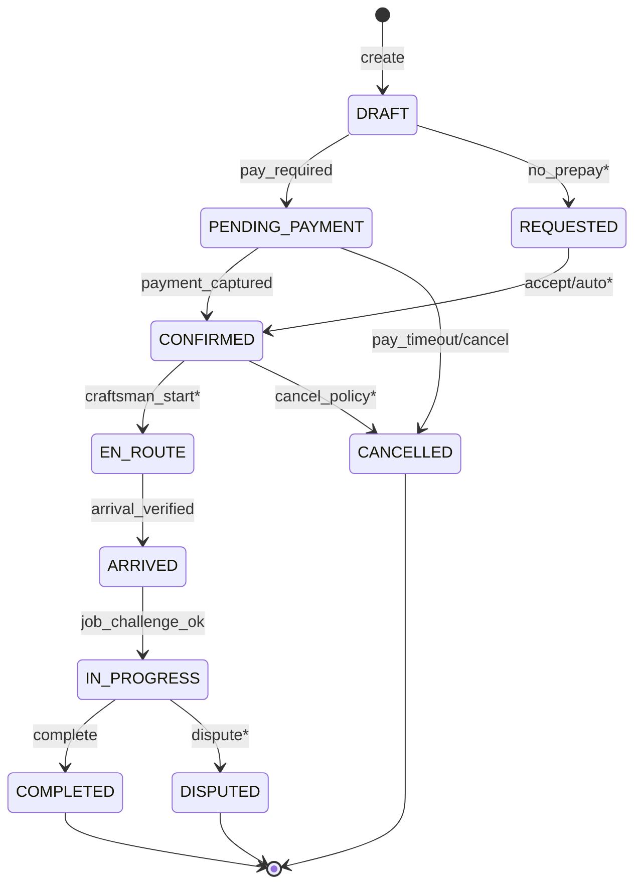
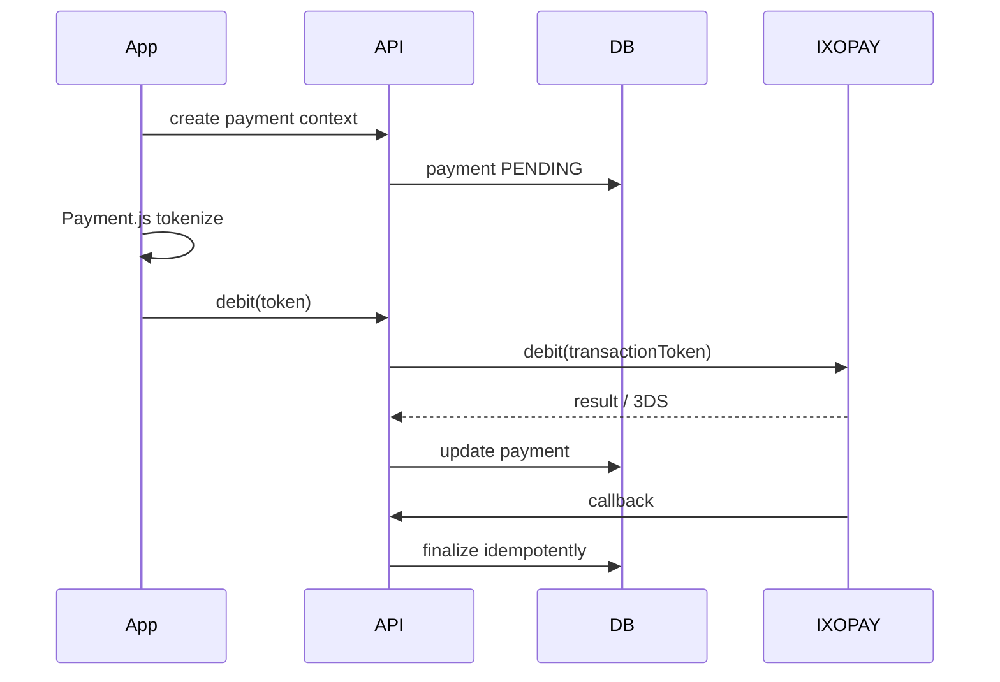

# 14. ER Diagram

**Document ID:** KHAD-V1-ERD  
**Status:** Draft for Approval  

This is a **logical** ER diagram for V1 core entities. Attribute-level detail is in Entity Relationship Mapping. Policy-dependent entities are marked with `*`.

---

## 14.1 Mermaid ER Diagram (Core)

```mermaid
erDiagram
  USER ||--o| CUSTOMER : "has"
  USER ||--o| CRAFTSMAN : "has"
  USER ||--o{ STORE_USER : "may have"
  STORE ||--o{ STORE_USER : "has"
  USER ||--o{ USER_ROLE : "has"
  ROLE ||--o{ USER_ROLE : "grants"
  ROLE ||--o{ ROLE_PERMISSION : "includes"
  PERMISSION ||--o{ ROLE_PERMISSION : "included_in"

  CUSTOMER ||--o{ CUSTOMER_ADDRESS : "has"
  CUSTOMER ||--o{ BOOKING : "places"
  CUSTOMER ||--o{ RATING : "writes"
  CUSTOMER ||--o{ ORDER : "places"

  CRAFTSMAN ||--o{ CRAFTSMAN_SERVICE : "offers"
  CRAFTSMAN ||--o{ BOOKING : "fulfills"
  CRAFTSMAN ||--o{ VERIFICATION_CASE : "undergoes"
  CRAFTSMAN ||--o{ SUBSCRIPTION : "subscribes"
  CRAFTSMAN ||--o{ WITHDRAWAL_REQUEST : "requests"

  STORE ||--o{ PRODUCT : "sells"
  STORE ||--o{ STORE_SERVICE : "offers"
  STORE ||--o{ ORDER : "receives"
  STORE ||--o{ AD_CAMPAIGN : "runs"
  STORE ||--o{ BOOKING : "may_own"

  CATEGORY ||--o{ CRAFTSMAN_SERVICE : "classifies"
  CATEGORY ||--o{ STORE_SERVICE : "classifies"
  CATEGORY ||--o{ PRODUCT : "classifies"

  BOOKING ||--o{ BOOKING_STATUS_HISTORY : "tracks"
  BOOKING ||--o{ PAYMENT : "paid_by"
  BOOKING ||--o{ JOB_CHALLENGE : "verifies"
  BOOKING ||--o| RATING : "reviewed_in"
  BOOKING ||--o{ COMMISSION_LINE : "generates"
  BOOKING ||--o{ SURVEY : "triggers"

  PAYMENT ||--o{ PAYMENT_ATTEMPT : "attempts"
  PAYMENT ||--o{ REFUND : "may_refund"
  PAYMENT ||--o{ PAYMENT_WEBHOOK : "receives"

  SUBSCRIPTION_PLAN ||--o{ SUBSCRIPTION : "defines"
  SUBSCRIPTION ||--o{ PAYMENT : "paid_by"

  COMMISSION_RULE ||--o{ COMMISSION_LINE : "applies"
  COMMISSION_LINE ||--o{ SETTLEMENT_PERIOD : "rolled_into"

  NOTIFICATION_TEMPLATE ||--o{ NOTIFICATION_DELIVERY : "renders"
  USER ||--o{ IN_APP_NOTIFICATION : "receives"

  VERIFICATION_CASE ||--o{ VERIFICATION_DOCUMENT : "includes"
  VERIFICATION_CASE ||--o{ OCR_RESULT : "produces"
  VERIFICATION_CASE ||--o{ FACE_CHECK : "produces"
  VERIFICATION_CASE ||--o{ GPS_CHECK : "produces"

  AD_CAMPAIGN ||--o{ AD_CREATIVE : "has"
  AD_CAMPAIGN ||--o{ AD_PLACEMENT : "scheduled_on"

  QUALITY_SCORE ||--|| CRAFTSMAN : "scores"
  RESTRICTION_RULE ||--o{ ACTOR_RESTRICTION : "applies"
  ACTOR_RESTRICTION }o--|| USER : "restricts"

  GLOBAL_SETTING ||--|| PLATFORM : "configures"
  AUDIT_EVENT }o--|| USER : "attributed_to"
  OUTBOX_EVENT ||--|| PLATFORM : "reliably_publishes"
```

> `PLATFORM` is conceptual (settings/outbox), not necessarily a table.

## 14.2 Booking Lifecycle Overlay

States marked `*` are **policy-gated** and must be confirmed via open questions before implementation freeze.

## 14.3 Payment Relationship Focus

## 14.4 Notes

- Not every join table is shown (`role_permissions`, etc. implied).  
- Media objects referenced by URL/id rather than binary in ER.  
- Exact nullability and enums appear in mapping doc.
