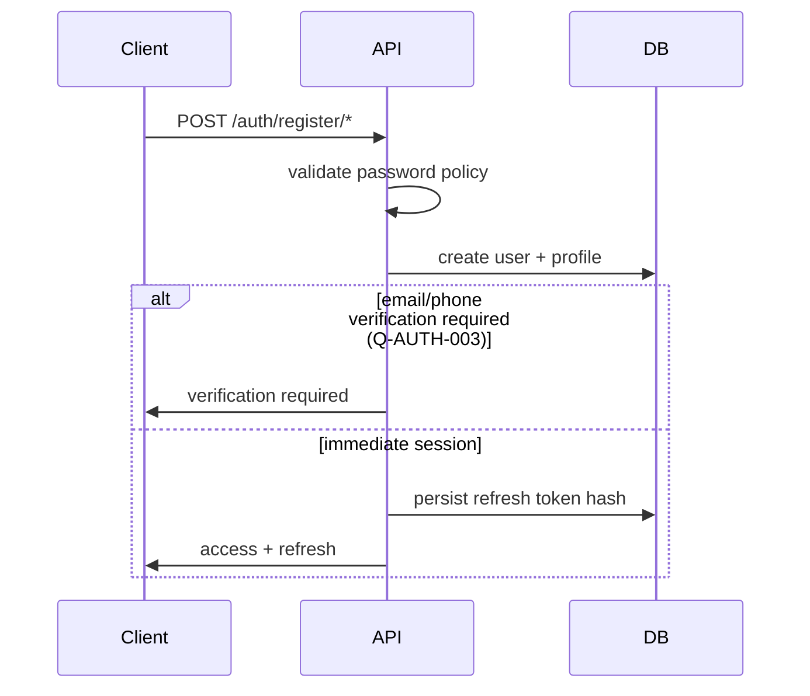

# 21. Authentication Flow

**Document ID:** KHAD-V1-AUTHN  
**Status:** Draft for Approval  

---

## 21.1 Actors & Channels

| Actor | Allowed login channel |
|-------|------------------------|
| Customer | Customer Flutter app (and future customer web if added) |
| Craftsman | Craftsman Flutter app |
| Store Operator | Store Dashboard (React web) |
| **Administrator (all admin roles)** | **Administration Portal (React web) only** |

**Hard rule (BR-008):** Administrators must **not** log in from mobile apps. Flutter apps must not expose admin login UI. The API must enforce audience/client restrictions so admin credentials cannot obtain a mobile session even if requested.

## 21.2 Token Model

| Token | Lifetime (suggested) | Storage |
|-------|----------------------|---------|
| Access JWT | 5–15 minutes | Memory (mobile/web) |
| Refresh | Days (Q-AUTH-005) | Secure storage / HttpOnly cookie |

JWT claims (minimum): `sub`, `sid`/`jti`, `roles`, `permissions` (or role only with permission lookup), `typ`, `iat`, `exp`.

Avoid oversized permission lists if claim size becomes an issue — alternative: role in token + permission cache server-side (Q-AUTH-006).

## 21.3 Registration Flow

## 21.4 Login Flow

1. Client submits identifier + password (+ device metadata)  
2. API checks status/lockout  
3. Verify password hash  
4. Issue access + refresh (new family)  
5. Record successful login audit/security event  

Failure increments attempt counter; threshold locks account temporarily.

## 21.5 Refresh Flow (Rotation)

1. Client sends refresh token  
2. API validates hash, expiry, revocation  
3. Invalidate old refresh  
4. Issue new access + refresh  
5. If old refresh reused → revoke entire family (possible theft)

## 21.6 Logout Flow

Revoke current refresh (or all sessions if “logout everywhere”).

## 21.7 Password Reset (**POLICY-GATED**)

Depends on Q-AUTH-004 (email link vs SMS OTP). Architecture supports both via notification module.

## 21.8 Mobile vs Web Differences

| Topic | Mobile | Web |
|-------|--------|-----|
| Refresh storage | flutter_secure_storage | HttpOnly cookie preferred (Q-FE-002) |
| Biometric unlock | Optional OS biometric to unlock app session | N/A |
| MFA | Optional for customer/craftsman | Strongly recommended / likely mandatory for admin (Q-AUTH-002) |
| Admin login | **Forbidden** | **Required channel for all admin roles** |

## 21.9 Admin Web-Only Enforcement

1. Login request includes `clientId` / `audience` (e.g. `admin-web`, `store-web`, `customer-app`, `craftsman-app`)  
2. If principal has any `ADMIN_*` role and audience ∉ `{admin-web}` → reject with `AUTH_ADMIN_WEB_ONLY`  
3. Access tokens issued for admin sessions carry audience claim `admin-web`  
4. Admin APIs (`/api/v1/admin/**`) accept only tokens with admin permissions **and** admin-web audience (defense in depth)  
5. Customer/Craftsman apps never render admin login or accept admin deep links for auth  

## 21.10 Questions Requiring Business Decision

`Q-AUTH-001` identifier, `Q-AUTH-002` MFA, `Q-AUTH-003` verification before session, `Q-AUTH-004` reset channel, `Q-AUTH-005` refresh TTL, `Q-AUTH-006` permissions in JWT vs lookup  

**Decided:** `Q-AUTH-007` — Administrators web-only (Administration Portal); no mobile admin login.
