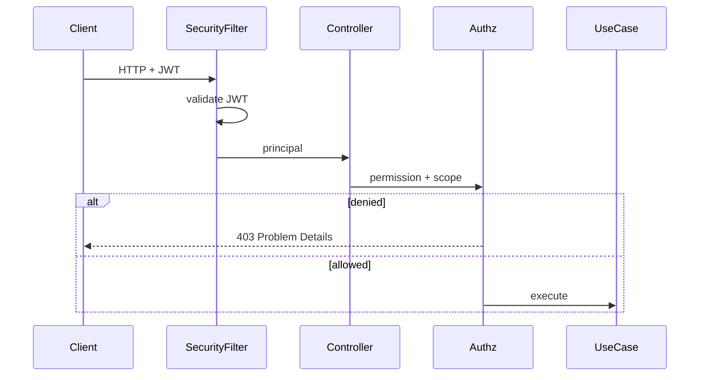

# 22. Authorization Flow

**Document ID:** KHAD-V1-AUTHZ  
**Status:** Draft for Approval  

---

## 22.1 Model

**RBAC with fine-grained permissions**, plus **resource scoping**.

```text
User → Roles → Permissions
Request → Authentication → Permission check → Resource scope check → Allow/Deny
```

## 22.2 Base Roles (Proposed — Pending Q-RBAC-001)

| Role | Scope |
|------|-------|
| `CUSTOMER` | Own customer resources |
| `CRAFTSMAN` | Own craftsman resources |
| `STORE_OPERATOR` | Own store resources |
| `ADMIN_SUPER` | All |
| `ADMIN_SUPPORT` | Limited read/update |
| `ADMIN_FINANCE` | Commissions, settlements, withdrawals |
| `ADMIN_OPS` | Onboarding, quality, restrictions |
| `ADMIN_CONTENT` | Ads, templates |

## 22.3 Permission Catalog (Sample)

| Permission | Description |
|------------|-------------|
| `users:read` / `users:write` | User management |
| `onboarding:approve` | Craftsman approval |
| `commission:write` | Edit commission rules |
| `settlement:read` | Settlement overview |
| `withdrawal:approve` | Approve payouts |
| `templates:write` | Notification templates |
| `ads:moderate` | Approve ads |
| `ratings:moderate` | Moderate reviews |
| `settings:write` | Global settings |
| `audit:read` | Audit logs |
| `reports:read` | Analytics/reports |

## 22.4 Request Authorization Sequence



## 22.5 Resource Scoping Rules

| Actor | Rule |
|-------|------|
| Customer | `booking.customerId == principal.customerId` |
| Craftsman | `booking.craftsmanId == principal.craftsmanId` (for job actions) |
| Store | `resource.storeId == principal.storeId` |
| Admin | permission-gated; optional region scope later |

## 22.6 Entitlement Gates (Beyond RBAC)

Authorization may also fail due to:

- Craftsman not approved  
- Missing active subscription (Q-SUB-002)  
- Active quality restriction  
- Payment not captured when action requires it  

These return distinct error codes (e.g., `ENTITLEMENT_SUBSCRIPTION_REQUIRED`) so clients can route UX.

## 22.7 UI Authorization vs API Authorization

UI may hide actions; **API remains source of truth**. Every privileged endpoint tested for negative authz.

## 22.8 Questions Requiring Business Decision

`Q-RBAC-001` final role/permission matrix; whether support staff can view full PII; region-scoped admin in V1.
