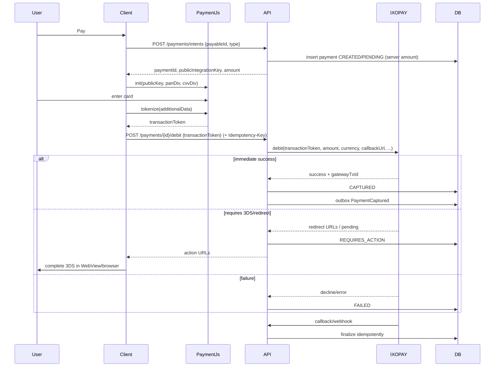

# 23. Payment Flow (Areeba IXOPAY Payment.js)

**Document ID:** KHAD-V1-PAY  
**Status:** Draft for Approval  

**V1 constraint:** Areeba IXOPAY Payment.js only. Abstraction mandatory.

---

## 23.1 Design Principles

1. KHADAMATI never handles raw PAN/CVV  
2. Business logic depends on `PaymentGatewayPort`  
3. Server trusts **server-side amounts**, not client  
4. Finality comes from gateway response + authenticated callback (idempotent)  
5. 3DS/redirect supported when gateway requires action  

## 23.2 Components

| Component | Responsibility |
|-----------|----------------|
| Client Payment UI | Initialize Payment.js with **public integration key**; hosted fields for PAN/CVV; `tokenize()` |
| API Payment Application | Create intent, call port.debit, update payable |
| `IxopayPaymentGatewayAdapter` | Map to IXOPAY debit XML/REST per merchant setup; credentials server-side |
| Webhook Controller | Verify callback; finalize payment |
| Outbox | Emit `PaymentCaptured` / `PaymentFailed` |

## 23.3 End-to-End Happy Path



## 23.4 Payable Types (V1 Candidates)

| Payable | In V1? |
|---------|--------|
| Booking | Yes |
| Craftsman subscription | Yes |
| Store order | Likely yes if store checkout online — Q-PAY-001 |
| Advertisement fee | Q-ADS-001 |
| Withdrawal is payout not card debit | Separate flow |

## 23.5 Adapter Port (Conceptual)

```text
debit(DebitCommand):
  merchant refs, transactionId (idempotent merchant id),
  transactionToken, amountMinor, currency,
  customer snapshot, callbackUrl, success/cancel/error URLs,
  withRegister?, transactionIndicator

refund(RefundCommand)
parseCallback(headers, body): CallbackEvent
```

## 23.6 Failure & Retry Semantics

| Case | Behavior |
|------|----------|
| Tokenize fails client-side | No debit called |
| Gateway timeout after debit | Payment stays PENDING; reconcile job + webhook |
| Duplicate debit request | Idempotency key returns original payment |
| Callback for unknown payment | Log + safe ignore/alert |
| Partial refund | POLICY-GATED Q-BOOK-004 |

## 23.7 PCI / Security Notes

- Public key in clients only  
- API user/password or connector credentials only on server  
- Do not log tokens or card metadata beyond gateway-permitted safe fields (last4/brand if provided)  
- Validate callback authenticity  

## 23.8 Abstraction for Future Gateways

```text
PaymentGatewayPort
  ├─ IxopayPaymentGatewayAdapter (V1)
  └─ FutureGatewayAdapter (V2+)
```

Gateway selected by config `khadamati.payment.active-gateway=areeba-ixopay`.

## 23.9 Mobile Specialization

Flutter hosts Payment.js page in WebView with JS bridge (see Flutter architecture). Same backend debit contract.

## 23.10 Questions Requiring Business Decision

- Q-PAY-001: online payment required for store orders in V1?  
- Q-PAY-002: save cards / register profiles (`withRegister`) in V1?  
- Q-PAY-003: which currencies enabled at launch?  
- Q-BOOK-004: refund rules  
- Q-ADS-001: are ads paid via this flow?
