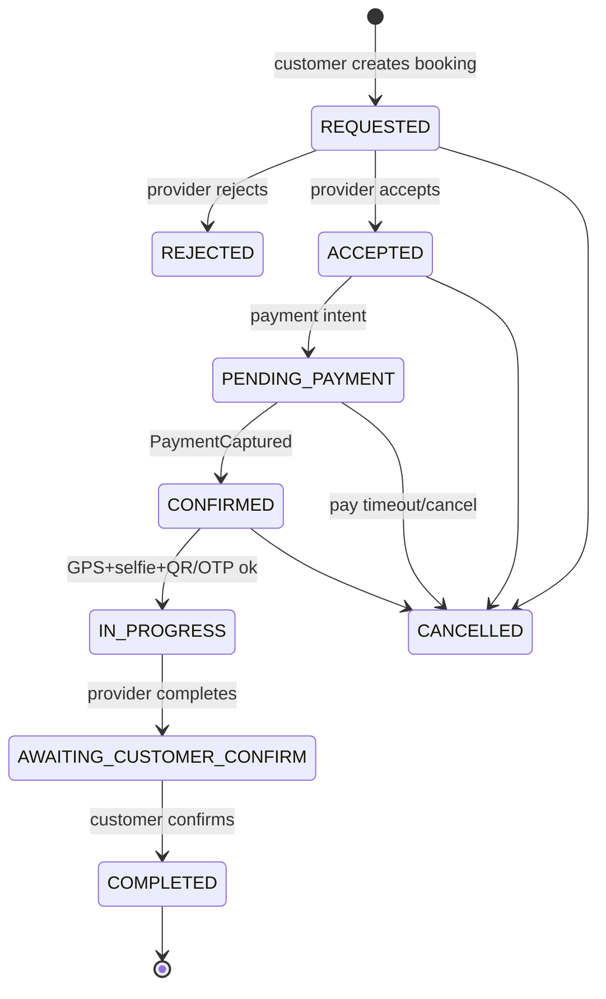

# 24. Booking Lifecycle

**Document ID:** KHAD-V1-BOOK  
**Status:** Draft for Approval  

---

## 24.1 Purpose

Define the booking aggregate lifecycle connecting customer demand, craftsman/store fulfillment, payment, verification, and quality follow-up.

## 24.2 Proposed State Machine (Pending Confirmation)

| State | Meaning |
|-------|---------|
| `DRAFT` | Created, not confirmed |
| `PENDING_PAYMENT` | Awaiting successful payment |
| `REQUESTED` | Submitted without immediate capture (if allowed) |
| `CONFIRMED` | Ready to be fulfilled |
| `EN_ROUTE` | Craftsman traveling |
| `ARRIVED` | Arrival verified |
| `IN_PROGRESS` | Job challenge passed / work started |
| `COMPLETED` | Work finished |
| `CANCELLED` | Cancelled per policy |
| `DISPUTED` | Dispute opened |
| `EXPIRED` | Payment/acceptance timeout |

**Questions Requiring Business Decision:** exact states and transitions — Q-BOOK-008, Q-BOOK-009, Q-BOOK-010.

## 24.3 Canonical V1 Flow (Master Prompt — Confirm Then Pay)

**Side effects:** CONFIRMED → schedule 24h reminder; COMPLETED → commission/ledger, survey, unlock rating; payment events → ledger.

> Earlier “prepaid before confirm” drafts are **superseded** by ADR-005.

## 24.4 Side Effects by Transition

| Transition | Side effects |
|------------|--------------|
| → PENDING_PAYMENT | Create payment intent |
| → CONFIRMED | Notify craftsman/store; schedule 24h reminder |
| → ARRIVED | Record verification; notify customer |
| → IN_PROGRESS | Start progress monitoring timers |
| → COMPLETED | Commission calculation event; survey schedule; unlock rating |
| → CANCELLED | Refund policy execution; notifications; release slots |

## 24.5 Scheduling Model

**Decided (ADR-019):** Provider Availability Calendar.

- Providers define working days/hours, exceptions, holidays, unavailable periods  
- Customers view available times and request a slot/window  
- System checks availability + service duration + conflicts  
- Then provider confirmation → payment  

## 24.6 Assignment Model

**Decided:** Customer selects provider/listing. Provider accepts/rejects. Store staff affiliation may fulfill store listings.

## 24.7 Reminder: 24-hour

Scheduler finds bookings with `scheduled_start` in configured window, not yet reminded, status eligible → notify → mark sent. Uses **Market timezone** (default Asia/Beirut).

## 24.8 Cancellation & Refund

**Decided structurally (ADR-013):** Cancellation and refund behavior is loaded from **admin-configured policies/rules** at runtime.

The booking engine must not embed fixed cancellation windows, actors, penalties, or refund percentages.

Finance Admin configures Lebanon policies before money go-live. Specific numeric values are configuration content, not code.

## 24.9 Data Integrity Rules

- Status changes only via domain service  
- Every transition appends `booking_status_history`  
- Optimistic locking on booking row  
- Payment capture required before CONFIRMED if prepaid model selected  

## 24.10 Questions Requiring Business Decision

`Q-BOOK-001`..`Q-BOOK-010`, `Q-REL-001`, `Q-NTF-003`, `Q-NTF-004`
