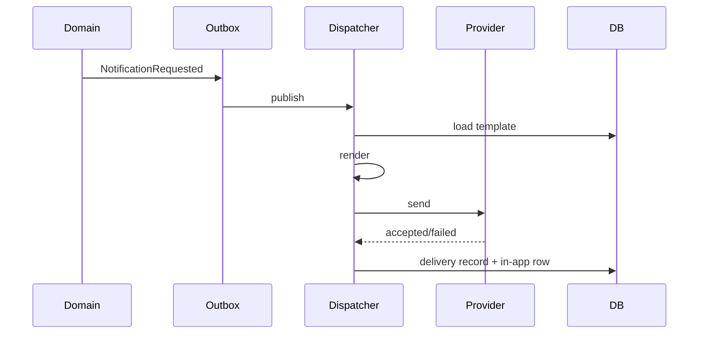

# 25. Notification Flow

**Document ID:** KHAD-V1-NTF  
**Status:** Draft for Approval  

---

## 25.1 Channels (V1)

| Channel | Use |
|---------|-----|
| Email | Receipts, approvals, admin alerts |
| SMS | OTPs, high-priority reminders (cost-sensitive) |
| In-app | Inbox inside mobile/web |
| Push | Mobile alert to open in-app notification |

Providers TBD: Q-NTF-001 (email), Q-NTF-002 (SMS).

## 25.2 Architecture

```text
Domain event → Outbox → Notification Dispatcher
   → resolve template(event, locale, channel)
   → render placeholders
   → send via provider adapters
   → persist delivery status
   → create in-app record if applicable
```

## 25.3 Template Model

- Keyed by `event_key` + `channel` + `locale` + version  
- Admin-editable in Administration Portal  
- Placeholders like `{{customerName}}`, `{{bookingCode}}`, `{{scheduledStart}}`  
- Fallback locale chain: user locale → default locale (Q-LOC-002)

## 25.4 Trigger Catalog (Representative)

| Event | Typical channels |
|-------|------------------|
| User registered | Email |
| Booking confirmed | Push + in-app + SMS? |
| 24h reminder | Push + in-app (+ SMS Q-NTF-003) |
| Craftsman approved/rejected | Push + email |
| Payment captured/failed | In-app + email |
| Survey available | Push + in-app |
| Withdrawal status changed | Push + email |
| Restriction applied | Push + email |

Exact channel matrix: Q-NTF-005.

## 25.5 Delivery Flow



## 25.6 Reliability

- At-least-once delivery; consumers idempotent by `event_id + channel + user_id`  
- Per-channel failure must not block other channels  
- Retry with exponential backoff; dead-letter after N attempts  
- OTP messages may have stricter TTL and single-purpose templates  

## 25.7 User Preferences (**OPEN**)

Can users disable marketing vs transactional? Transactional should remain mandatory. Decision Q-NTF-006.

## 25.8 Security

- No secrets in templates  
- Mask PII in dispatcher logs  
- Admin template changes audited  

## 25.9 Questions Requiring Business Decision

`Q-NTF-001`..`Q-NTF-006`, `Q-LOC-002`
