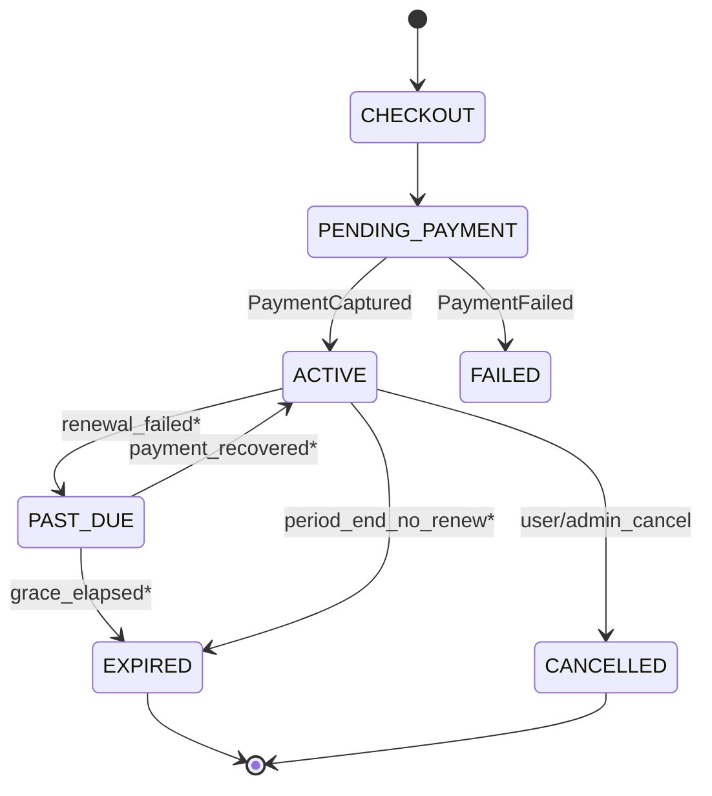

# 26. Subscription Workflow

**Document ID:** KHAD-V1-SUB  
**Status:** Draft for Approval  

---

## 26.1 Purpose

Monetize and gate craftsman (and optionally store) platform access via plans.

## 26.2 Core Entities

- `subscription_plans` — commercial offering + entitlements  
- `subscriptions` — active/past subscription instances  
- Payments via Payment module  

## 26.3 Proposed Lifecycle

`*` grace/renewal behavior is POLICY-GATED (Q-SUB-003).

## 26.4 Entitlements (Examples — Not Final)

Possible entitlement keys:

- `jobs.accept`  
- `catalog.max_services`  
- `featured.listing`  
- `withdrawal.request`  

Exact gating matrix: Q-SUB-002.

## 26.5 Subscribe Flow

1. Craftsman lists plans  
2. Selects plan → create subscription `PENDING_PAYMENT` + payment intent  
3. Payment.js debit  
4. On capture → subscription `ACTIVE`, period dates set  
5. Notify success  

## 26.6 Renewal Flow (**OPEN**)

Options:

- Manual re-subscribe each period  
- Auto-renew with stored payment profile (`withRegister`) if Q-PAY-002 allows  
- Admin complimentary periods  

Decision: Q-SUB-003, Q-PAY-002.

## 26.7 Store Subscriptions

Whether stores buy plans in V1: Q-SUB-001.

## 26.8 Admin Capabilities

- CRUD plans (price, period, entitlements, active flag)  
- View subscriber lists  
- Force-expire / extend (audited)  

## 26.9 Questions Requiring Business Decision

`Q-SUB-001`..`Q-SUB-004` (including free tier existence), `Q-PAY-002`
