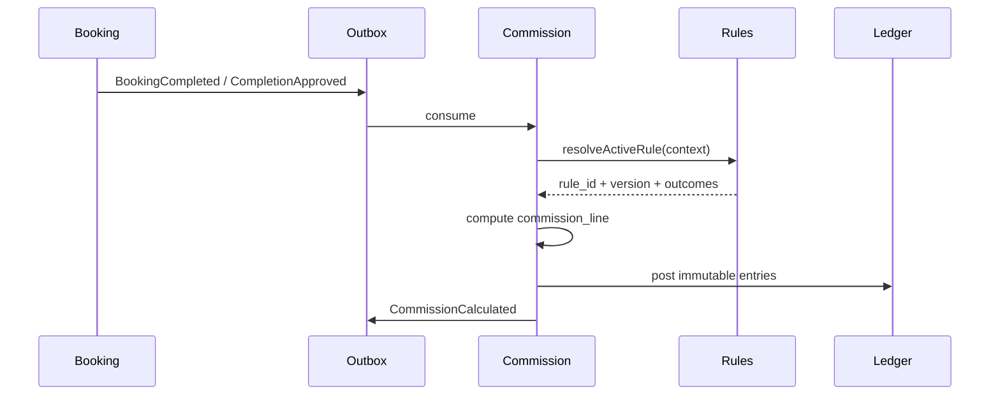

# 27. Commission Workflow

**Document ID:** KHAD-V1-COM  
**Status:** Aligned to ADR-013  

---

## 27.1 Purpose

Calculate platform revenue share from monetizable events using **admin-configured commission rules**, then post immutable ledger entries and feed settlement/withdrawal views.

## 27.2 Design Principle

- Commission **engine** is deterministic given an active rule set  
- Rule **definitions and values** live in Admin Portal configuration — **never hardcoded**  
- Do **not** assume one global commission percentage  
- Matching may use: market, service category, provider type, subscription level, booking value, effective dates, priority  

## 27.3 Admin Configuration Capabilities

Authorized Finance/Super Admin can configure:

- Default percentage and/or fixed amount  
- Category-based rules  
- Provider-type based rules (craftsman vs store)  
- Market-specific rules (Lebanon now; GCC later)  
- Effective dates + activate/deactivate  
- History + audit trail on every change  

## 27.4 Trigger Events

| Event | Commissionable? |
|-------|-----------------|
| Booking completed / completion approved (canonical) | Yes — per active rules |
| Payment captured into escrow | May create holds; commission typically on completion (configurable trigger if needed) |
| Subscription payment | Platform revenue (usually not provider commission) |
| Ads/promotions | Platform revenue unless rule says otherwise |

## 27.5 Calculation Flow

## 27.6 Commission Line Lifecycle

`CALCULATED` → `FINALIZED` → `SETTLED` (names may refine)  
Refunds reverse via **admin refund rules** + reversing ledger entries (ADR-013).

## 27.7 Settlement Overview

Admin read model + **settlement_rules** configuration (cadence, reserves). Not hardcoded schedules-as-business-truth.

## 27.8 Withdrawal Interaction

Withdrawals validated by **withdrawal_methods / withdrawal_configs** (min amounts, methods, approval). Available balance derived from ledger, not a lone mutable wallet field.
