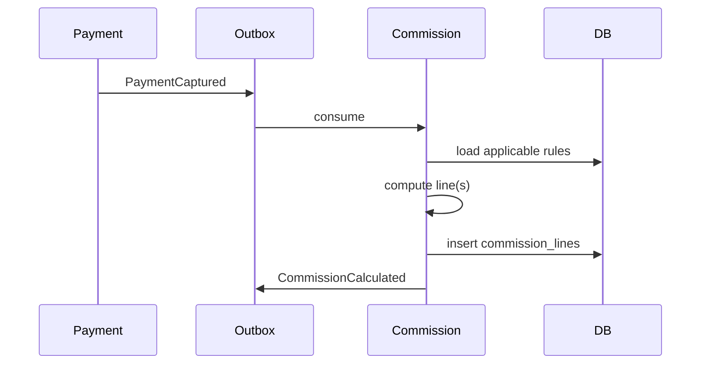

# 27. Commission Workflow

**Document ID:** KHAD-V1-COM  
**Status:** Draft for Approval  

---

## 27.1 Purpose

Calculate platform revenue share from monetizable events and feed settlement/withdrawal views.

## 27.2 Design Principle

Commission **engine** is deterministic given a rule set. Rule **values and model** are business decisions and must not be invented in code.

## 27.3 Trigger Events (Candidates)

| Event | Commissionable? |
|-------|-----------------|
| Booking payment captured | Likely yes |
| Store order payment captured | Q-COM-002 |
| Subscription payment | Usually platform revenue (not commission) |
| Ad payment | Platform revenue vs commission Q-COM-003 |

## 27.4 Proposed Calculation Flow

## 27.5 Rule Model Options (**OPEN** — Q-COM-001)

1. Flat percentage of booking amount  
2. Percentage by category  
3. Percentage by craftsman tier/subscription  
4. Fixed fee + percentage  
5. Separate store vs craftsman splits  

Architecture stores versioned rules with effective dating regardless of option.

## 27.6 Commission Line Lifecycle

`ESTIMATED` → `FINALIZED` → `SETTLED` / `WRITE_OFF` (names pending)

Reversals on refund: Q-COM-004.

## 27.7 Settlement Overview

Admin read model aggregating:

- Gross captured volume  
- Platform commission  
- Craftsman/store net  
- Pending withdrawals  
- Settled amounts  

Settlement cadence Q-SET-001.

## 27.8 Withdrawal Interaction

Withdrawals should only allow amounts consistent with available net earnings after commissions/reserves. Reserve/hold policy: Q-SET-004.

## 27.9 Questions Requiring Business Decision

`Q-COM-001`..`Q-COM-005`, `Q-SET-001`, `Q-SET-004`
