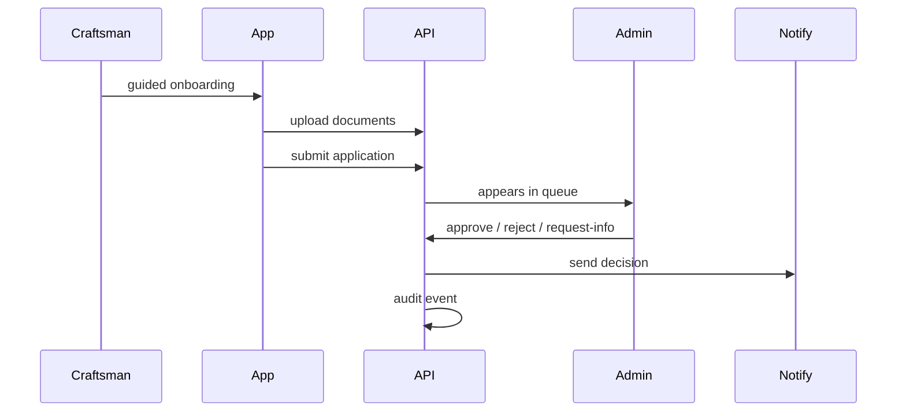

# 28. Craftsman Approval Workflow

**Document ID:** KHAD-V1-ONB  
**Status:** Draft for Approval  

---

## 28.1 Goal

Ensure craftsmen meet platform trust requirements before performing jobs.

## 28.2 States

| State | Description |
|-------|-------------|
| `DRAFT` | Profile created; onboarding incomplete |
| `SUBMITTED` / `PENDING_APPROVAL` | Awaiting admin decision |
| `NEEDS_INFO` | Admin requested more documents/data |
| `APPROVED` | Eligible for entitlement checks / jobs |
| `REJECTED` | Not approved |
| `SUSPENDED` | Previously approved, now blocked |

Exact naming freeze after Q-ONB-003.

## 28.3 Flow

## 28.4 Required Dossier (**OPEN**)

Checklist examples (not final): national ID, selfie, certifications, address proof, service categories. Final checklist Q-ONB-001.

## 28.5 Automated Assists

- OCR extract fields for admin review  
- Face match selfie vs ID photo  
- Completeness validation before submit  

Automation may **assist** but admin decision remains authoritative unless business chooses auto-approve rules (Q-ONB-004).

## 28.6 Resubmission Policy (**OPEN**)

After rejection, can craftsman resubmit? Cooldown? Q-ONB-002.

## 28.7 Post-Approval Effects

- Status APPROVED  
- Subscription gate evaluated  
- Notification sent  
- Possibly searchable in catalog (if subscription ok)

## 28.8 Admin UX Capabilities

- Queue filters  
- Document viewer  
- OCR/face scores visible  
- Decision with mandatory reason on reject/request-info  
- Audit trail  

## 28.9 Questions Requiring Business Decision

`Q-ONB-001`..`Q-ONB-004`
