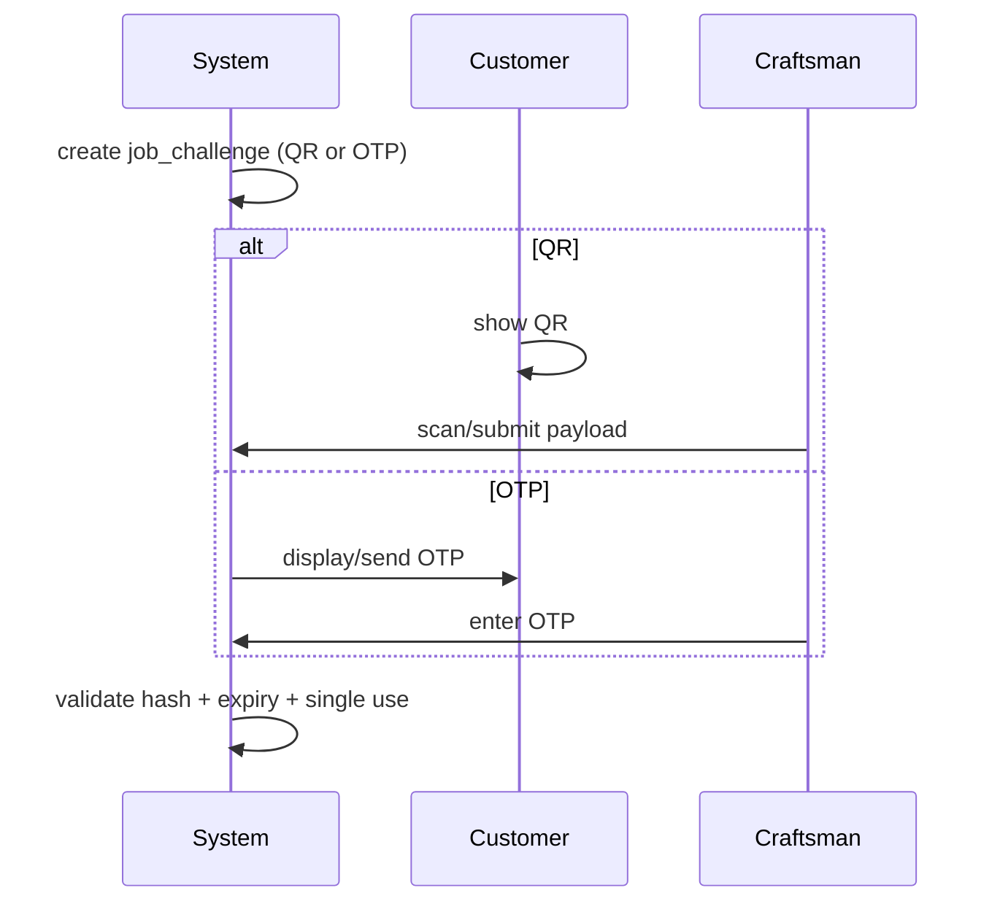

# 29. Identity Verification Workflow

**Document ID:** KHAD-V1-IDV  
**Status:** Draft for Approval  

Covers onboarding identity and job-time verification (GPS, selfie, QR/OTP). OCR and Face Recognition are supporting capabilities.

---

## 29.1 Verification Case Model

Each attempt is a `verification_case` with purpose:

- `ONBOARDING`  
- `JOB_ARRIVAL`  
- `JOB_START`  
- `JOB_COMPLETE` (if required)

## 29.2 Onboarding Identity

```text
Upload docs → Object storage
→ OCR extract (async)
→ Selfie capture
→ Face match vs reference
→ Aggregate scores on verification_case
→ Admin uses results during approval
```

Providers: Q-OCR-001, Q-IDV-002.

## 29.3 GPS Proximity Verification

1. Job has target coordinates (customer address / site)  
2. Craftsman submits current lat/lon/accuracy/timestamp  
3. Server computes distance  
4. Pass if distance ≤ threshold **and** accuracy acceptable (Q-IDV-001)  
5. Persist `gps_checks`  

Anti-spoofing depth (mock location detection) is Q-IDV-005.

## 29.4 Real-time Selfie Verification

1. App opens camera gated capture  
2. Optional liveness (Q-IDV-004)  
3. Upload media  
4. Provider face match against onboarding reference  
5. Pass/fail vs threshold Q-IDV-003  
6. Record `face_checks`  

## 29.5 QR / OTP Job Verification



Which jobs require QR vs OTP vs both: Q-IDV-007.

## 29.6 Orchestration with Booking

Verification successes drive booking transitions (`ARRIVED`, `IN_PROGRESS`, etc.) only when policy requires them.

## 29.7 Failure Handling

- Retry limits  
- Escalation to support  
- Fallback manual admin override (audited) — Q-IDV-008  

## 29.8 Data Retention & Privacy

Selfies/docs retention and purge jobs: Q-IDV-006.

## 29.9 Questions Requiring Business Decision

`Q-IDV-001`..`Q-IDV-008`, `Q-OCR-001`
