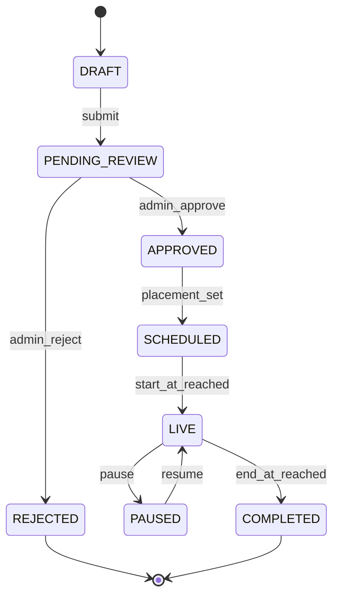

# 30. Advertisement Workflow

**Document ID:** KHAD-V1-ADS  
**Status:** Draft for Approval  

---

## 30.1 Purpose

Allow stores (and possibly platform/admin) to promote placements in customer surfaces.

## 30.2 Actors

- Store Operator: create/manage campaigns  
- Admin/Content: approve, schedule, place, pause  
- Customer App: render placements  
- Payment module: if ads are paid (Q-ADS-001)

## 30.3 Lifecycle

## 30.4 Placement Model

| Concept | Description |
|---------|-------------|
| Placement slot | e.g., home banner, category sponsor, search featured |
| Creative | image/video refs + click target |
| Schedule | start/end, priority, region/locale targeting readiness |
| Frequency caps | optional V1.x |

Exact inventory of slots: Q-ADS-002 (depends on UI designs).

## 30.5 Monetization Options (**OPEN**)

1. Free ads moderated only  
2. Paid flat campaign fee via IXOPAY  
3. Subscription entitlement includes ad credits  

Decision Q-ADS-001 / Q-ADS-003.

## 30.6 Serving Flow

Customer app requests ads for slot → API returns ranked active creatives → client renders → optional impression/click events (metrics depth Q-ADS-004).

## 30.7 Moderation & Compliance

- Admin can reject with reason  
- Creative policy (no prohibited content) — business/legal Q-ADS-005  
- Audit approvals  

## 30.8 Questions Requiring Business Decision

`Q-ADS-001`..`Q-ADS-005`
