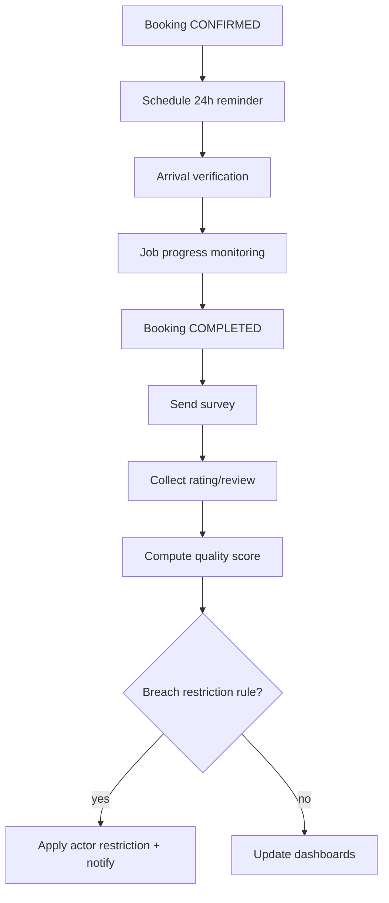

# 31. Quality Follow-up Workflow

**Document ID:** KHAD-V1-QUA  
**Status:** Draft for Approval  

---

## 31.1 Objectives

- Reduce no-shows and ambiguity via reminders & verification  
- Measure satisfaction  
- Score quality  
- Restrict poor performance automatically  

## 31.2 Workflow Components

| Component | Trigger |
|-----------|---------|
| 24h booking reminder | Scheduler near scheduled start |
| Arrival verification | Booking transition window |
| Job progress monitoring | Timers while IN_PROGRESS |
| Satisfaction survey | After COMPLETED |
| Quality scoring | After survey/rating/events |
| Restriction rules | Score/threshold breaches |

## 31.3 End-to-End

## 31.4 Survey

- One survey per completed booking (idempotent)  
- Channel: push/in-app (+ email optional)  
- Questions set: Q-QUA-001  
- Links back to rating module where overlapping  

## 31.5 Quality Scoring Model (**OPEN**)

Candidate inputs:

- Average rating  
- Cancellation rate  
- Verification failure rate  
- Survey CSAT  
- Dispute rate  

Weights/thresholds: Q-QUA-002.

## 31.6 Restriction Rules

Examples (not final):

- Score < X for Y days → cannot accept new jobs  
- Manual admin restriction  
- Auto-lift after improvement period  

Details: Q-QUA-003.

## 31.7 Operational Visibility

Admin dashboards show:

- Reminder delivery rates  
- Verification pass rates  
- Open in-progress jobs beyond SLA (SLA Q-QUA-004)  
- Restricted actors  
- Survey response rates  

## 31.8 Questions Requiring Business Decision

`Q-QUA-001`..`Q-QUA-004`, related booking verification requirements
